# Router setup

## SFR routers

https://assistance.sfr.fr/internet-tel-fixe/box-plus/accueil.html

We have following SFR routers / ISP BOX
- SFR Box NB6 Fibre/ADSL (carre)
- SFR Box Box Plus Fibre/ADSL
- SFR Box 7 Fibre/ADSL
- SFR Box 8 Fibre/ADSL

Nota
- Nota Box 7 fibre and Box 8 fibre have integrated ONT
- Box Plus Fibre needs an ONT. This will actually become an advantage
- SFR Box Plus Fibre need separated ONT
- Box Plus Fibre is
    - commercially sold as SFR Box 7 
    - Has NB6-VAC as technical name

## Standard setup with SFR Box Plus Fibre 

### ADSL

`ADSL — DSL —> “SFR box Plus Fibre” -> ETH or WiFi client`

### Fiber

`Fiber — pon —> ONT — Fiber / ETH —>  “SFR box Plus Fibre”— ETH/ ETH SWITCH/ Wifi —> client`


## Setup with SFR BOX Plus Fibre and WIFI router (google Nest / Flint)

- https://store.google.com/orderdetails/GS.5226-3873-8463?pli=1&hl=fr (oct 21)
- https://www.amazon.fr/Google-Nest-Wifi-WiFi-Blanco/dp/B088NMHP23

### ADSL

`ADSL — DSL —>  “SFR box Plus Fibre”— ETH —> Google Nest  —> ETH SWITCH / Wifi —> client`


### Fiber

`Fiber — pon —> ONT — Fiber / ETH —>  “SFR box Plus Fibre”— ETH —> Google Nest  —> ETH SWITCH / Wifi —> client`

We can replace the Google Nest with by `GL-iNet Flint 3`.

This requires a double NAT for external access to client behind Google Nest/Flint (google nest offers bridge mode: https://support.google.com/googlenest/answer/6240987?hl=en&co=GENIE.Platform%3DAndroid).

Note we can still use Wifi or ethernet port of SFR Box Plus Fibre.


Note that Flint router offers in that setup Drop-in gateway: https://docs.gl-inet.com/router/en/4/interface_guide/drop-in_gateway/

## CG-NAT

I asked SFR to not apply CG-NAT when moved to Fiber:
FttH: Migration forcée vers de l'IPv4 CG-Nat (+IPv6):  https://lafibre.info/sfr-les-news/ipv4-cgnat/

## SFR BOX STATUS


From http://192.168.1.1/state

```text
Adresse MAC	: e4:HIDDEN
Version	: NB6VAC-MAIN-R4.0.47h3
Profil d'accès	: FTTH
Connectivité	: IPv4 & IPv6

Modèle	NB6VAC-FXC-r0
Adresse MAC	e4:HIDDEN
Version principale	NB6VAC-MAIN-R4.0.47h3
Version de secours	NB6VAC-MAIN-R4.0.45d
Version driver DSL	NB6VAC-XDSL-A2pv6F039p
Temps de service	
```

<-- Did status with back-up setup [](#back-up-setup-or-in-case-no-ont-or-if-too-hard-to-get-box-directly-connected) described below in reality (Flint3) unlike speed test which is done with Google Nest -->

## Speed test: Fiber + SFR box +  Nest router + MAC MINI

https://speed.cloudflare.com

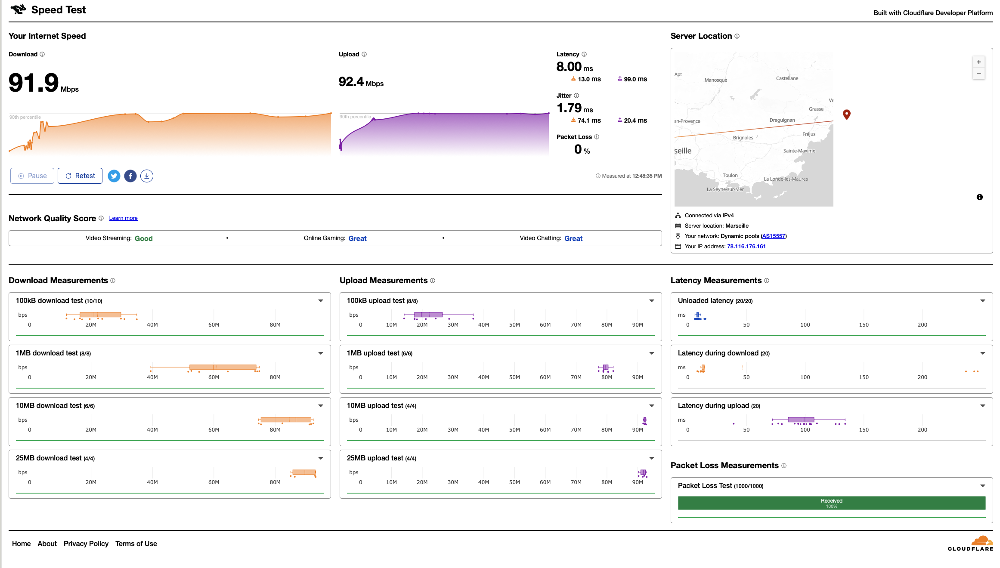

## Flint 3 first time connection


- Connect to network via QR code


- Or via (Mac mini) personal Hotpost available (this not 5G or 6G but 2G network) - Can force to `192.168.8.1`

- Set password admin user and
   - wifi (2G, 5G, 6G) SSID
   - pwd

- Enable dynamic bandwidth


## Remove SFR BOX

We can replace ISP SFR Box by using Open WRT

This avoids full control and avoids setup of double NAT :) !

```text
Fiber — pon —> ONT — Fiber / ETH —>  Flint 3 WAN —> ETH SWITCH / Wifi —> client 
```


### OpenWRT setup 

Remplacer sa box SFR par un routeur: https://lmorel3.fr/posts/2019-12-netgear-wndr4300-openwrt/

> On peut désormais brancher le routeur directement sur le boîtier de réception de la fibre (ONT), et débrancher la Neufbox. Il ne reste plus qu’à configurer le DHCP pour qu’SFR nous attribut une IP. L’astuce réside dans le fait de spécifier un vendorid commençant par neufbox-. Par “convention”, il semblerait judicieux de le spécifier sous la forme neufbox-BypassedNeufbox-XXXXX@XXXX.XX. Ce n’est pas obligatoire, mais cela permetterait aux techniciens de comprendre qu’il s’agit d’une installation custom5.

Modifier le fichier de configuration du réseau

```shell
ssh root@192.168.1.1
vi /etc/config/network
config interface 'wan'
    option proto 'dhcp'
    option vendorid 'neufbox-BypassedNeufBox-XXXX@XXX.XX'
    # Laisser les options par défaut

config interface 'wan6'
    option proto 'dhcpv6' 
    # Laisser les options par défaut
```

### About vendor ID

- [FTTH] Tuto bypass complet neufbox avec un routeur OpenWrt: https://lafibre.info/remplacer-sfr/ftth-tuto-bypass-complet-neufbox-avec-un-routeur-openwrt/
- NBV6AC : IPV6, DHCPv6 avec le GPON, vendor class ?: https://lafibre.info/remplacer-sfr/nbv6ac-ipv6-dhcpv6-avec-le-gpon-vendor-class/

### Flint 3 - Access to LUCI interface

https://docs.gl-inet.com/router/en/4/interface_guide/advanced_settings/


### Flint 3 - My tuto to bypass SFR box

Go to LuCI interface
- http://192.168.8.1/#/internet
- Exit network mode
- On the left side of `web Admin Panel` -> `SYSTEM` -> `Advanced Settings`

Or click the link http://192.168.8.1:8080/cgi-bin/luci/ access LuCI page (root / admin user pw, not wifi pw, but I set up the the same for convenience usually => see encrypted folder)


Then `Network > Interfaces > wan > edit` 

Set as below for device eth0

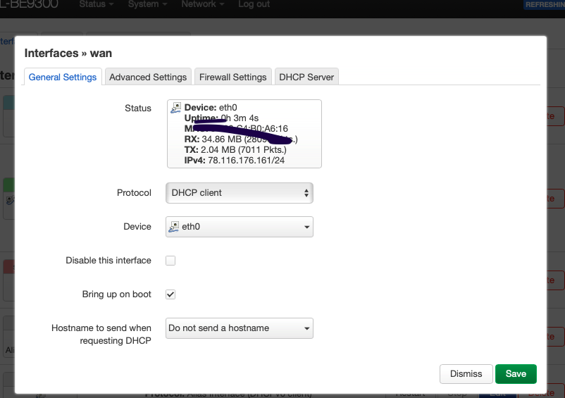

Then advance settings, and fill “Vendor Class to send when requesting DHCP”

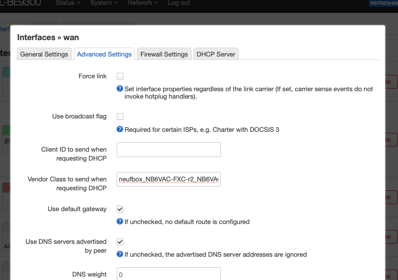


In advanced settings set Vendor id : `neufbox_NB6VAC-FXC-r2_NB6VAC-MAIN`
Alternatively for example set Vendor Id to `neufbox_NB6VAC-bypass-sylvain.coulombel@sfr.fr`

Then yo will see 

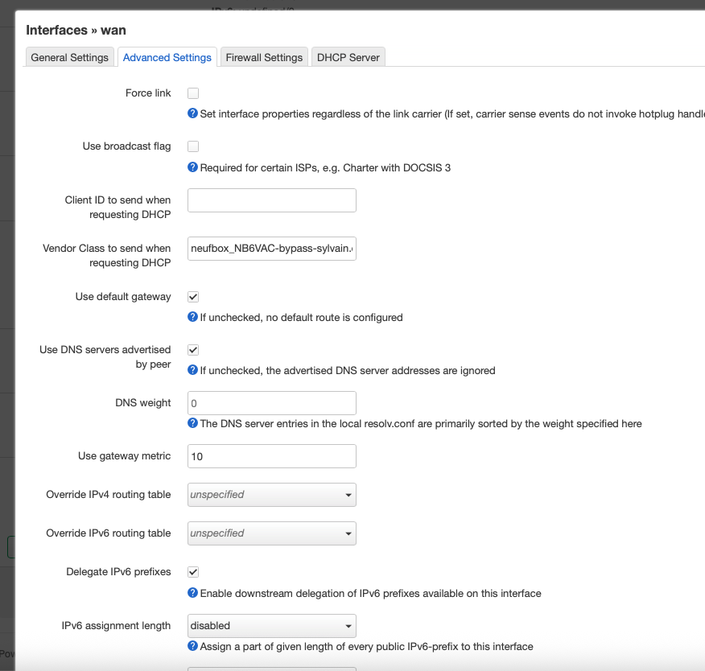


And do apply changes (you will see a diff, do not forget to apply change)

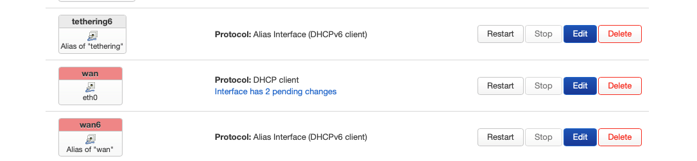

Click save and apply

We should start receiving packets:

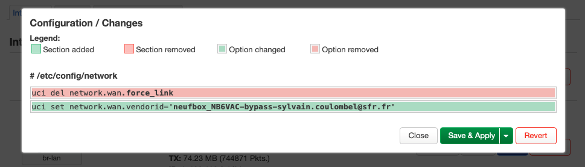

You can see internet is working + IPv4 assigned

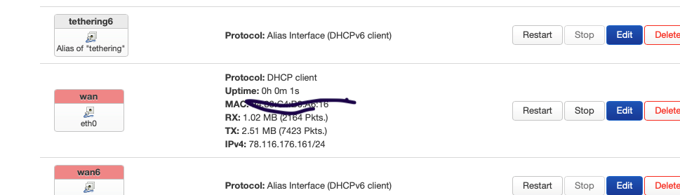

### Back-up setup or in case no ONT or if too hard to get box directly connected

Assume this vendor IP tips stops working.

I will stop using google router but I propose this 

```
Fiber — pon —> ONT — Fiber / ETH —>  FLINT 3  —> ETH SWITCH / Wifi —> client 
                                                             —> “SFR box Plus Fibre”— ETH —> FLINT 3  —> ETH SWITCH / Wifi —> client 
```

When doing this think to re-start the SFR BOX (it works, tested with MAC MINI) and proof is

http://192.168.1.1/network

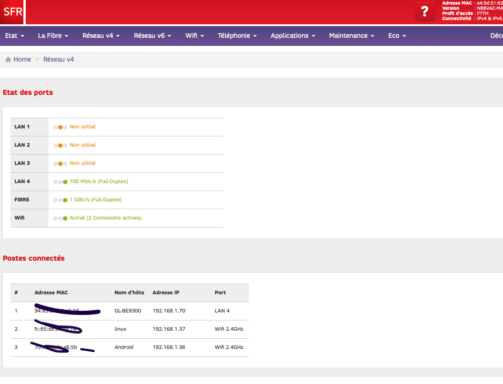

And Internet works 

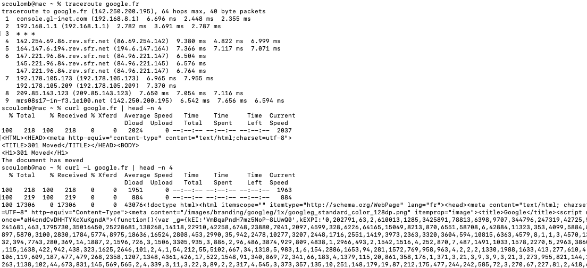

Here we come back to setup in section [## Setup with SFR BOX Plus Fibre and WIFI router (google Nest / Flint)](#setup-with-sfr-box-plus-fibre-and-wifi-router-google-nest--flint)]. Where new Flint 3 is used. 

Also we can obviously used box wifi but will require to re-configure all devices (unless we keep Google home with same [SSID with tehnique used here](#seams-less-migration-), but it requires to keep in sync devices.

Note that doing this backup setup, even if vendor ID is set does not impact :)

<!--
OK tested
STOP OK for this section — OK - dupe of section a bit but OK - here device to home not working as using flint 3 so need to use flint nw
-->


## Seams less migration 

We will avoid impacting clients.

I will move from a WIFI exposed by Google Home router to Flint 3 

And I will use setup [Remove SFR BOX](#remove-sfr-box) setup 

We will 
- Get SSID/pw from google nest router 
  - scoulomb
  - [WIFI pwd](./flint3-router-setup-media/encrypted/wifi-pwd.txt)
- Reset google nest router  - DONE
- Rest flint 3 for setup with same SSID/password as of nest Network (admin password same as wifi pw) -> scoulomb, scoulomb-5G, scoulomb-6G
    - [Flint 3 first time connection](#Flint-3-first-time-connection)
        - Choose 2G network to keep same SSID
    - [Remove SFR box](#remove-sfr-box)


wireless networking - What happens if my neighbour sets his wifi SSID the same as mine? - Super User: https://superuser.com/questions/738353/what-happens-if-my-neighbour-sets-his-wifi-ssid-the-same-as-mine

Note when 
- Access to interface on http://192.168.8.1/#/internet (if scoulomb network was known even from previous router you see you will be reconnected)
- You can see client of previous router are already there:

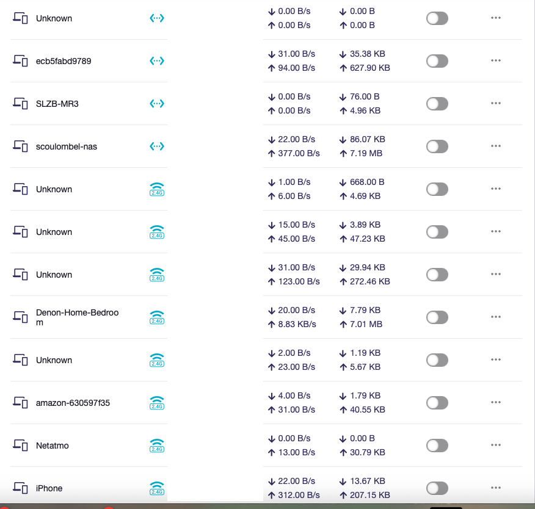

- Later reconfigure what you want on 5G or 6G (optional) - See speed test above
https://www.intel.com/content/www/us/en/products/docs/wireless/2-4-vs-5ghz.html#:~:text=The%20lower%202.4%20GHz%20band,congestion%20for%20better%20overall%20performance. 

- Note google home was 5GHz network 


## Speed test: Fiber + Flint 3 direct + MAC MINI

https://speed.cloudflare.com

- 2G
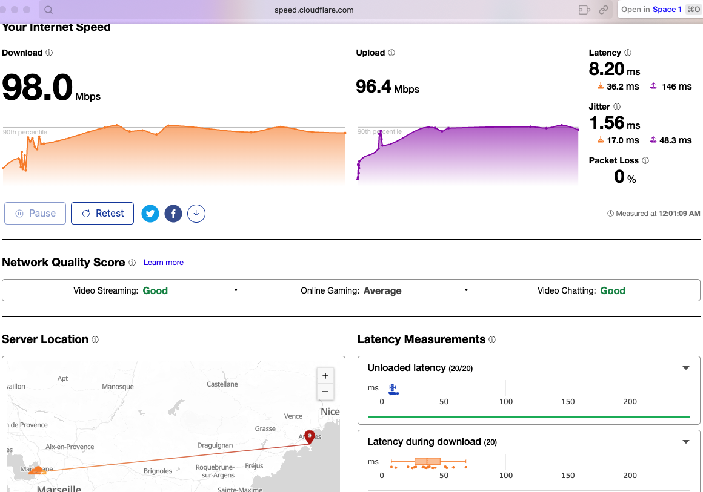

- 5G
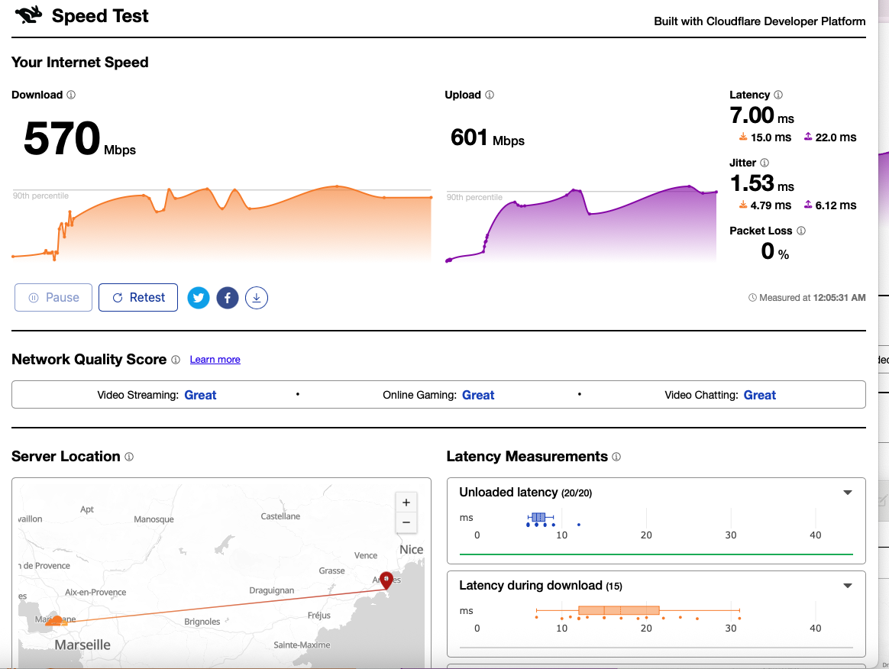

- 6G

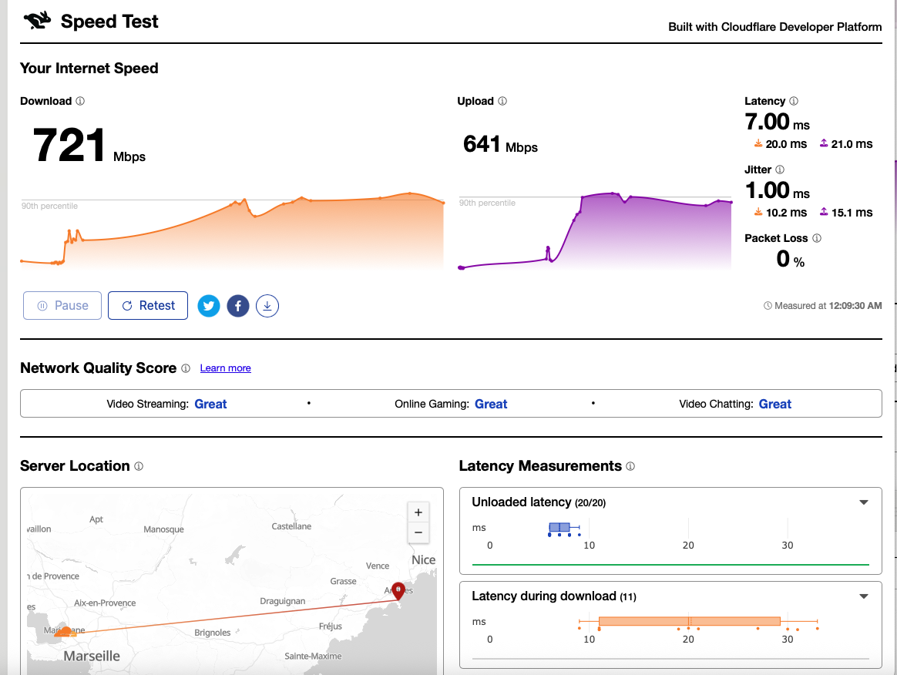

6G great for video streaming
See the difference


I did test the back-up setup [Fiber + SFR box + flint 3 + mac mini](#back-up-setup-or-in-case-no-ont-or-if-too-hard-to-get-box-directly-connected) with flint3 connected to SFR box.
What I did is [with nest router](#speed-test-fiber--sfr-box--nest-router--mac-mini)

## Should I use switch or not

- Flint 3 has 5x2.5G ETH, non POE: https://www.gl-inet.com/products/gl-be9300/

- Netgear switch supports 10/100/1000 (GIGABIT etc, non POE): https://www.netgear.com/support/product/gs108tv1/
  - 

- NAS has only gigabyte ethernet when non extension card
  - TS-251D-4G-EU- https://mail.google.com/mail/u/0/#search/qnap+ts/WhctKKXPfjFrRPPmXTllBDNZCHkWNWVHhvSwQLwRWpcRsSgbvKmNnWVVHtWrdSjKMktDMGG 


So I will do the ethernet swith with 
- NAS (and HEOS) direct on router 
- Domotic hub + home assistant on Netgear

<!--
ROUTER SETUP ALL DONE CCL - STOP OK - no read OK
Wondering if box 8 has a WAN or 2.5 GHz
Do not think

Next applications and co, ddns, ipv6 interface, http://192.168.8.1/#/wireless …
Next zigbee: gw tuya and mrw3
-->

<!-- git config http.postBuffer 524288000 -- https://stackoverflow.com/questions/15240815/git-fatal-the-remote-end-hung-up-unexpectedly -->