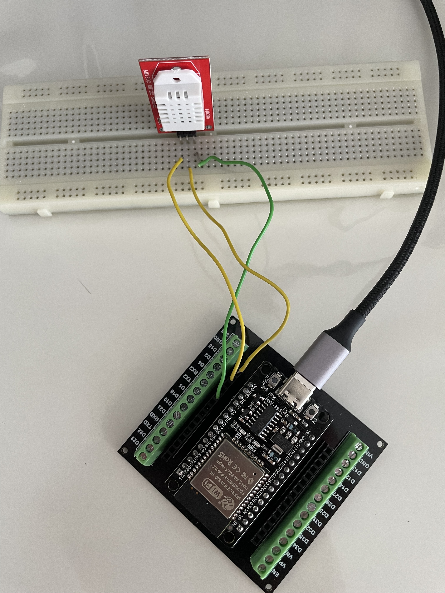
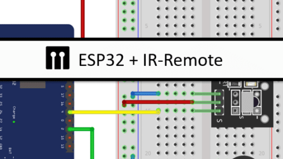

# 🛠️ Getting Started with Home Assistant and ESPHome

### Build a temperature and humidity sensor

### 1. Enable HTTPS for Home Assistant
To ensure secure external access, first configure Home Assistant to use HTTPS.  
👉 Refer to the guide: [../external-access/README.md](../external-access/README.md)

---

### 2. Initial Firmware Flash via USB

- Prepare your ESP device for its first firmware upload.
- **Important**: Disconnect all electronic wiring before flashing.
- Flash the initial version of the firmware using a USB connection.
- Be patient — this step may take a few minutes.

---

### 3. Configure Wi-Fi Credentials

- Edit the YAML configuration file to include your Wi-Fi SSID and password.
- Flash the updated YAML again via USB.
---

### 4. Switch to Over-the-Air (OTA) Updates
- Once the device is connected to Wi-Fi, you can update it wirelessly.
- Use OTA to push future YAML updates without needing a USB connection.
- See [dht22.yaml](./media/dht22_anonym.yaml) -- 

With credentials

````shell
gpc -c dht22.yaml
gpg --output dht22.yaml --decrypt dht22.yaml.gpg

````

Note `api.encryption.key` and `ota.platform.password` are generated by esphome.
Wifi credentials could be externalized with `!`

---

## 5. Do wiring



---

## 6. Set Up Devices and Services
- 
- Begin integrating your devices and services within ESPHome.
- This enables seamless interaction with Home Assistant.

🔗 For detailed guidance on setting up RMT (Remote Control) devices, visit:  
[https://esphome.io/guides/setting_up_rmt_devices.html](https://esphome.io/guides/setting_up_rmt_devices.html)

---

--- 

## Build IR remote

Very good tuto: https://community.home-assistant.io/t/faking-an-ir-remote-control-using-esphome/369071/3 <!-- tip to modify with inverted true and also use of dump: raw -->
 
Note we still have same concerns with Daikin (all in one command).
<!-- no xref in SLZB ok -->
Note we could also flash a Tuya device: https://devices.esphome.io/devices/AVATTO-S06-IR-Remote-no-temp-no-humidity-new-version


### IR receiver 

Wiring is pretty forward

From: https://www.makerguides.com/esp32-and-ir-remote-interface/


Add this to the config

````yaml
# Example configuration entry
remote_receiver:
  pin: 
    number: GPIO4
    inverted: True
  dump: raw
````

Learn code

### IR transmitter 

See https://esphome.io/components/remote_transmitter.html

For wiring: https://www.makerguides.com/control-air-conditioner-via-ir-with-esp32-esp8266/ (note that Arduino wiring are the same)

For resistance value: https://www.ma-calculatrice.fr/calculer-valeur-resistance-couleur

```yaml
# built via copilot
remote_transmitter:
  pin: GPIO2  # Replace with the actual GPIO pin connected to your IR LED
  carrier_duty_percent: 50%

switch:
  - platform: template
    name: "Send Raw IR Signal"
    turn_on_action:
      - remote_transmitter.transmit_raw:
          code: [3561, -1533, 596, -227, 630, -227, 629, -1100, 595, -228, 629, -1099, 596, -228, 628, -1100, 595, -229, 628, -228, 628, -1101, 594, -229, 628, -229, 627, -1100, 595, -1101, 594, -229, 627, -230, 626, -231, 626, -231, 625, -232, 625, -231, 625, -232, 625, -232, 624, -1103, 592, -233, 622, -1105, 591, -234, 623, -233, 623, -235, 602, -1123, 579, -256, 593, -1123, 569, -274, 582, -274, 583, -274, 582, -275, 582, -274, 583, -274, 582, -275, 582, -274, 582, -275, 582, -1127, 567, -276, 581, -275, 582, -275, 581, -1128, 568, -274, 582, -275, 582, -275, 581]      
````


