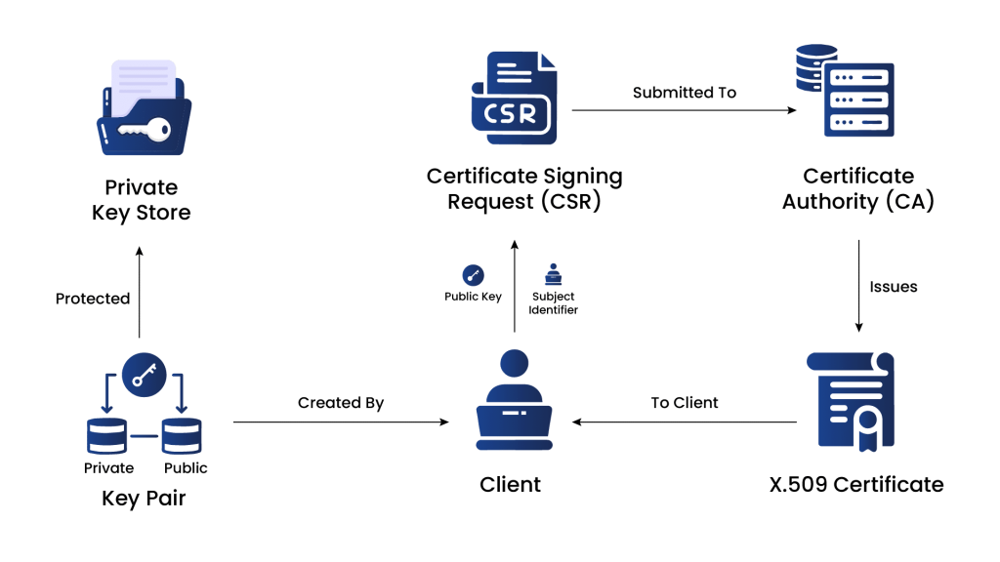

# Certificate and F5 terminology 

See this documentation as entry point: https://github.com/scoulomb/misc-notes/blob/master/tls/tls-certificate.md#man-in-the-middle-attach-and-need-of-a-ca
<!-- xref done: https://github.com/scoulomb/misc-notes/blob/master/tls/tls-certificate.md#complements -->
<!-- 
keep cert in https://github.com/scoulomb/misc-notes/blob/master/tls/tls-certificate.md#man-in-the-middle-attach-and-need-of-a-ca as is OK as reflect well history
Fix done in https://github.com/scoulomb/misc-notes/commit/fd0eae038bf32323e34dc7c7c6c11a0b44089f6d is compliant with all details here
Note the usage of public key in RSA handshake different in others (OK if refer to this consider RSA)
-->
Note here on [private key](./private-keys.md)
 
## Simplified terminology 

Good terminology here: https://securityboulevard.com/2024/04/what-is-certificate-provisioning/
> Certificate provisioning refers to the process of obtaining, deploying, and managing digital certificates within an organization’s IT infrastructure. 

## Certificate enrollment and full process

From https://www.encryptionconsulting.com/education-center/what-is-certificate-enrollment-and-how-is-it-used/ 

Certificate Enrollment is the process by which an entity, such as an individual or an organization, requests and obtains a digital certificate from a Certificate Authority (CA). 
Digital certificates are used to secure communications and authenticate the identity of a server, client, or user in various secure protocols like SSL/TLS (for securing websites), S/MIME (for email encryption and signing), and more.

The primary purpose of certificate enrollment is to obtain a digital certificate that contains a public key and associated identity information (such as the Common Name, Organization, etc.).
The CA signs the certificate, establishing a trusted relationship between the public key and the entity’s identity. 
This process ensures that the entity’s identity is validated and that the public key can be used securely for encryption, digital signing, or other cryptographic operations.

The Comprehensive Lifecycle of Certificate Enrollment (IMO installation, use and renewal could be considered out of enrollment, procurement can be used as synonym of enrollment).
We can also call this certificate issuance, even if in reality it is a sub-step.
This is aligned with https://github.com/scoulomb/misc-notes/blob/master/tls/tls-certificate.md#man-in-the-middle-attach-and-need-of-a-ca

### Generating Certificate Signing Request (CSR)

To initiate the certificate enrollment process, the entity generates a **Certificate Signing Request (CSR)**. The CSR includes:
- The **public key**
- Information about the entity, such as:
  - Domain name (for SSL/TLS certificates)
  - Email address (for S/MIME certificates)

### Submitting the CSR to the CA

The CSR is submitted to the **Certificate Authority (CA)** during the enrollment process. The CA verifies:
- The identity of the entity
- The information in the CSR

Verification methods may include:
- Email verification
- Domain validation  
- Manual verification of legal documents

=> Perso notes: domain validation includes: Add via DNS-01, HTTP-01, and TLS-ALPN-01: https://letsencrypt.org/fr/docs/challenge-types/
=> Here is DigiCert process: https://www.digicert.com/faq/public-trust-and-certificates/how-do-i-order-a-tls-ssl-certificate

### Certificate Issuance

Once the CA completes verification and confirms the entity’s legitimacy, it issues a **digital certificate** containing:
- The entity’s public key
- Identity information
- Validity period
- The CA’s digital signature

### Certificate Delivery

The issued certificate is delivered back to the entity. Delivery methods may include:
- Email
- Secure portal
- Other secure channels

### Certificate Installation
The entity installs the certificate on the appropriate server or device.  
For example, in SSL/TLS, the certificate is installed on the **web server** to secure website connections.

=> This can be done via Venafi which push certificate to F5 cluster<!--Test/Prod + internet/extranet -->.

### Certificate Use

Once installed, the certificate enables **secure communication protocols**.  
Clients and users can verify the certificate’s authenticity via the CA’s digital signature, ensuring a **secure and trustworthy connection**.

### Certificate Renewal

Certificates have a limited validity period (typically **1–2 years**).  
Before expiration, the entity must **renew the certificate** through a similar enrollment process to avoid service disruption.

<!-- => New+Inbound+Links+creation --> 

## SSL offloading means this

https://www.f5.com/fr_fr/glossary/ssl-offloading

> Le déchargement SSL est le processus de suppression du cryptage SSL du trafic entrant pour soulager un serveur Web de la charge de traitement du décryptage et/ou du cryptage du trafic envoyé via SSL. Le traitement est déchargé sur un périphérique distinct conçu spécifiquement pour l'accélération SSL ou la terminaison SSL .
La terminaison SSL est particulièrement utile lorsqu'elle est utilisée avec des clusters de VPN SSL , car elle augmente considérablement le nombre de connexions qu'un cluster peut gérer.

And not to deploy cert on the F5

## We can find same steps referenced in my TLS doc with CA 

- signature of CSR by user + signature of cert by CA
- See https://github.com/scoulomb/misc-notes/blob/master/tls/tls-certificate.md#man-in-the-middle-attach-and-need-of-a-ca

## self-signed and signed by CA

Also in myDNS

<!-- link to Case, 17jul25 and more precise -->
- Generate a self-signed certificate: https://github.com/scoulomb/myDNS/blob/master/2-advanced-bind/5-real-own-dns-application/6-use-linux-nameserver-part-g.md#step-1-how-to-generate-a-self-signed-certificate
- Generate a certificate signed by a public CA: https://github.com/scoulomb/myDNS/blob/master/2-advanced-bind/5-real-own-dns-application/6-use-linux-nameserver-part-h.md#step-1-how-to-generate-a-certificate-signed-by-ca
  - Quoting
    - > - Without shell access (they support different hosting providers, it is equivalent to shell access server validation). Github page falls into that [category](https://community.letsencrypt.org/t/web-hosting-who-support-lets-encrypt/6920).
          It relies on the fact DNS (own or Gandi live DNS) is pointing to server. {add: at least of github so server validation}
    - > With shell access: https://certbot.eff.org/lets-encrypt/ubuntufocal-other where we have
        > - Server validation (standalone or not). 
        > - TXT record validation.   
    - Note here from https://letsencrypt.org/fr/docs/challenge-types/,
      - Server validation: `HTTP-01` (port 80), `TLS-ALPN-01` (port 443), `TLS-SNI-01` (deprecated, port 443)
      - DNS validationn (TXT record): `DNS-01`
    - Here showed how to deploy this cert on Python server(via double nat directly at the [cf external access README](../README.md) or to an Ingress k8s (with double NAT). Ingres is equivalent to our nginx proxy manager.
    - See also https://certbot.eff.org, the webserver validation
    - We can generate a CSR manually: https://phoenixnap.com/kb/generate-openssl-certificate-signing-request (instead of cert bot))
  - Self-signed vs signed?:
    - From: https://medium.com/@talyitzhak/understanding-digital-certificates-and-self-signed-certificates-b1cdca759bbc
    - >   A self-signed certificate is a certificate that is signed by the same entity whose identity it certifies. Unlike certificates issued by a CA, self-signed certificates are not inherently trusted by other systems and require manual configuration to be trusted. They are often used in development and testing environments where setting up a CA is not necessary. “Self-signed” means that the public key embedded in the certificate validates the signature on the certificate.
    - So here is the key https://github.com/scoulomb/myDNS/blob/master/2-advanced-bind/5-real-own-dns-application/6-part-g-use-certificates/appa.prd.coulombel.it.key used for CSR and CA...
- We can also generate a signed certificate by private CA 
  - CA should be added to truststore: https://github.com/scoulomb/misc-notes/blob/master/tls/tls-certificate.md#man-in-the-middle-attach-and-need-of-a-ca. See here chain of certificate: https://github.com/scoulomb/misc-notes/blob/master/tls/tls-certificate.md#chain-certificate-and-certificate-verification
  - Which explains why a private CA can be added to truststore <!--confirmed by copilot -->
- See [Certificate Comparison: Self-Signed vs Private CA vs Public CA](./self-signed-vs-private-ca-vs-public-ca.md)

We can also sign a JWT with private key: https://github.com/scoulomb/misc-notes/blob/af5d6dd89ad1f59af2f82883a3fdc5b3719ca41f/tls/oauth-appendix.md?plain=1#L11 
<!-- but not found here as in case https://github.com/scoulomb/myDNS/blob/main/2-advanced-bind/5-real-own-dns-application/6-use-linux-nameserver-part-h.md#L738 -->

<!-- priv script mtls etc stop -->

## SAN, CN, SNI

See here [differences between SAN (Subject Alternative Name), CN (Common Name), and SNI (Server Name Indication) in the context of SSL/TLS certificates](./ssl_certificate_differences.md)
DCV work for CN and SAN. Some browser can ignore CN or require all domain defined in SAN even if in CN. (source copil)

SNI is not in cert.

What about our cert? (used chrome here as https://discussions.apple.com/thread/256041834?answerId=261330994022&sortBy=rank#261330994022)
It has on chrome `Subject.CN equal` to `Extension.certificateSAN` equal to `homeassistant.coulombel.net` <!-- check when decryption, see zscaler below... but ok as iphone renders the same, left on screen then ..., connection sec details -->
It has on Iphone `SUBJECT Name.commonName` and `Subject Alternative Name.DNS name` equal to `homeassistant.coulombel.net`

Note we can use an IP in ssl cert: https://www.geocerts.com/support/ip-address-in-ssl-certificate - [back-up](./Using-an-IP-Address-in-an-SSL%20Certificate-GeoCerts.pdf). And work for SAN.<!-- no dive here-->

Sides notes: there’re cases where a given F5 virtual server can be configured to use multiple clientSSL which the profile used is chosen based on the Server Name Indication (SNI).
<!-- link to tm f5-app where cert not updated back to ip -->

Exactly one of the clientSSL (on F5 server, blu), see link to /private_script/ Links-mig-auto-cloud/2025-consolidation/README.md#tls-certificates) profile needs to be marked as “SNI default“.
Evaluation order [source: https://my.f5.com/manage/s/article/K55504740]
1. Server Name configured in the Client SSL profiles
2. Subject Alternative Name of an SSL certificate used by the Client SSL profiles
3. Common Name of an SSL certificate used by the Client SSL profiles
<!-- link to complex vs Ok-->

## Link to cert in private script

See also link with /private_script/ Links-mig-auto-cloud/2025-consolidation/README.md#tls-certificates

## About SSH 

- Note we have documented here TLS/SSL: https://crypto.stackexchange.com/questions/60255/why-doesnt-ssh-use-tls
  - Stack is HTTP / TLS xor SSL / TCP / IP / ARP / ethernet xor  wifi / optical (https://fr.wikipedia.org/wiki/Suite_des_protocoles_Internet#/media/Fichier:TCPIP_couche_ISO_modele_OSI.png)
  - Note abusively we call HTTP over TLS: HTTPs 
  - SSL vs TLS: https://aws.amazon.com/compare/the-difference-between-ssl-and-tls/#:~:text=SSL%20is%20technology%20your%20applications,that%20fixes%20existing%20SSL%20vulnerabilities.
    - > Secure Sockets Layer (SSL) is a communication protocol, or set of rules, that creates a secure connection between two devices or applications on a network. It’s important to establish trust and authenticate the other party before you share credentials or data over the internet. SSL is technology your applications or browsers may have used to create a secure, encrypted communication channel over any network. However, SSL is an older technology that contains some security flaws. Transport Layer Security (TLS) is the upgraded version of SSL that fixes existing SSL vulnerabilities. TLS authenticates more efficiently and continues to support

- Note SSH is not using TLS/SSL: https://crypto.stackexchange.com/questions/60255/why-doesnt-ssh-use-tls
  - Stack is SSH/TLS xor SSL
  - SSH certificates are described here:  https://github.com/scoulomb/misc-notes/blob/master/tls/tls-certificate.md#complements and https://github.com/scoulomb/misc-notes/blob/master/lab-env/README.md#ssh-summary
  - OpenSSH can use CA, but less frequent, and they do not use X.509 standard but OpenSSH-specific format

## Netskope, zscaler, cloudfare decryption 

Interesting feature is SSL (it is TLS in reality) decryption <!--corp -->

See
- https://docs.netskope.com/en/ssl-decryption/
- https://www.zscaler.com/fr/resources/security-terms-glossary/what-is-ssl-decryption
- https://developers.cloudflare.com/cloudflare-one/policies/gateway/http-policies/tls-decryption/....

> SSL decryption policies are applied right after traffic is steered to Netskope. By default, all traffic steered to Netskope will be decrypted, then further analyzed via Real-time Protection policies. In addition, all policies are disabled and you must enable them from the list view. 

Note github
- has SSH and TLS: https://docs.github.com/en/authentication/connecting-to-github-with-ssh
- And https://git-scm.com/book/en/v2/Git-Internals-Packfiles

- If SSH pub/priv key generated by `ssh-keygen`: https://docs.github.com/en/authentication/connecting-to-github-with-ssh/generating-a-new-ssh-key-and-adding-it-to-the-ssh-agent in local
- If SSH, more complex SSL decryption as not a webtraffic HTTT <!-- stop there-->

<!-- We can call this CA shaddow -->

Also similar to
- How to Setup Squid Proxy Server for Network Traffic Analysis | Linux Tutorials for Beginners: https://webhostinggeeks.com/howto/how-to-setup-squid-proxy-server-for-network-traffic-analysis/
- PiHole and Wireguard (by default on flint 3)
<!-- link proxy when lic osef -->

<!-- also notes: /private_script/ /Links-mig-auto-cloud/2025-consolidation/README.md
Matrix
Outbound explicit SNAT (standard vs, same as F5 to app when re-encrypt)
Outbound Transparent SNAT (Forward F5 VS)
FW SNAT

could do same role of proxy OK
No need to xref in priv script OK
-->