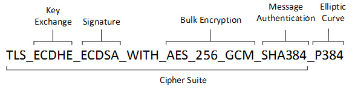

# Les Cipher Suites

From https://www.next-decision.fr/wiki/cipher-suites-quest-ce-cest

Les Cipher Suites (suites cryptographiques en français), sont des ensembles d’algorithmes cryptographiques utilisés pour sécuriser les connexions réseau, principalement via les protocoles SSL et TLS, qui sont la base de la sécurité pour HTTPS, ainsi que d’autres protocoles sécurisés.

Ces ensembles d’algorithmes sont tous composés de plusieurs algorithmes cryptographiques qui fonctionnent ensemble pour sécuriser les communications réseau.

## CONFIGURATION DES CIPHER SUITES

Sur Windows, la configuration des Cipher Suites se fait habituellemnt via le registre ou des outils comme IIS Crypto.

Sur Linux, on configure généralement ses algorithmes dans les fichiers de configuration des applications (exemple : ssl.conf dans Apache), ou en utilisant des variables d’environnement.

## PROCESSUS DE NÉGOCIATION DES CIPHER SUITES
Lorsqu’une connexion TLS s’établit, un processus de négociation des Cipher Suites se déroule comme ceci :

### 1/ Initiation de la connexion par le client (exemple : navigateur web, client de messagerie…)

Envoi d’un message ClientHello au serveur. Ce message comporte :

- La version SSL/TLS la plus élevée supportée par le client
- Un nombre aléatoire généré par le client (utilisé plus tard pour la génération des clés de session)
- Une liste ordonnée des suites cryptographiques supportées par le client
- Les méthodes de compression supportées
- Eventuelles extensions TLS

### 2/ Réponse du serveur

Le serveur répond avec un message ServerHello qui inclut :

- La version SSL/TLS choisie
- Un nombre aléatoire généré par le serveur
- La suite cryptographique sélectionnée parmi celles proposées par le client
- La méthode de compression choisie
- Les extensions TLS supportées

### 3/ Authentification et échange de clés

- Envoi du serveur de son certificat dans un message Certificate
- Il peut envoyer un message ServerKeyExchange contenant des paramètres supplémentaires pour l’échange de clés
### 4/ Fin de la phase serveur

Le serveur envoie un message ServerHelloDone, indiquant qu’il a terminé sa partie de négociation initiale

### 5/ Réponse du client

- Vérification du certificat du serveur
- Envoi d’un message ClientKeyExchange contenant les informations nécessaires pour générer la clé de session

### 6/ Changement de spécification de chiffrement

Le client ainsi que le serveur envoient un message ChangeCipherSpec pour indiquer qu’ils vont commencer à utiliser les nouveaux paramètres cryptographiques négociés

### 7/ Finalisation

Les deux parties envoient chacun un message Finished chiffré avec les nouveaux paramètres, contenant un hash de tous les messages précédents pour vérifier l’intégrité de la négociation.

## Importance des Cipher Suites

- **Sécurité** : Ses algorithmes assurent la confidentialité, l’intégrité et l’authentification des communications.
- **Flexibilité** : Larges choix d’algorithmes pour s’adapter à différents besoins de sécurité et performances.
- **Comptabilité** : Différents systèmes peuvent communiquer ensemble de manière sécurisée (exemple : serveurs cloud, applications mobiles, systèmes de paiement, serveurs de messagerie…)

## PROTOCOLES POUVANT UTILISER LES CIPHER SUITES

- SSL (Secure Sockets Layer)
- TLS (Transport Layer Security)
- DTLS (Datagram Transport Layer Security)
- IPsec (Internet Protocol Security)
- SSH (Secure Shell)
- QUIC (Quic UDP Internet Protocol)
- MLS (Messaging Layer Security)
- SRTP (Secure Real-time Transport Protocol)
- WPA3 (Wi-Fi Protected Aceess 3)

## NOMMAGE DES ALGORITHMES CRYPTOGRAPHIQUES

Les noms de ses algorithmes varient en fonction du système d’exploitation du serveur.

### SUR WINDOWS

Sur Windows, les Cipher Suites sont généralement nommées en utilisant la bibliothèque Schannel. Le format de nommage suit une convention standardisée qui inclut différents composants :

- Protocole (exemple : TLS, MLS)
- Échange de clés (exemple : RSA, ECDHE, SRP…)
- Authentification : Combinée avec l’algorithme d’échange de clés
- Chiffrement : Algorithme de chiffrement symétrique (exemple : AES, CAMELLIA, 3DES, RC4…), suivi de la taille de la clé (exemple : 128, 256…)
- Mode de chiffrement : Spécifie le mode (exemple : GCM, CBC…)
- Hachage : Indique l’algorithme de hachage utilisé pour le MAC (exemple : SHA256, MD5…)

Attention, la nomenclature des algorithmes peut changer en fonction de la version du protocole utilisé.

#### Liste des différents Cipher Suites pouvant être utilisés (recommandé par l’ANSSI) :

**TLS 1.2 :**

- TLS_ECDHE_RSA_WITH_AES_256_GCM_SHA384
- TLS_ECDHE_RSA_WITH_AES_128_GCM_SHA256
- TLS_ECDHE_RSA_WITH_AES_256_CBC_SHA384
- TLS_RSA_WITH_AES_256_GCM_SHA384
- TLS_RSA_WITH_AES_128_CBC_SHA256

**TLS 1.3 :**

- TLS_AES_256_GCM_SHA384
- TLS_CHACHA20_POLY1305_SHA256
- TLS_AES_128_GCM_SHA256
- TLS_AES_128_CCM_SHA256
- TLS_AES_128_CCM_8_SHA256

### SUR LINUX

Sur Linux, ces algorithmes sont souvent gérés par OpenSSL et suivent une convention similaire, mais avec de légères différences :

- Protocole : Uniquement pour TLS 1.3 (exemple : TLS, MLS)
- Échange de clés et authentification : Généralement combinés en un seul segment (exemple : ECDHE-RSA)
- Chiffrement : Algorithme de chiffrement symétrique (exemple : AES, CAMELLIA, 3DES, RC4), suivi de la taille de la clé (exemple : 128, 256…)
- Mode de chiffrement : Spécifie le mode (exemple : GCM, CBC…)
- Hachage : Indique l’algorithme de hachage utilisé pour le MAC (exemple : SHA256, RIPEMD-160, MD5…)

#### Exemple de Cipher Suites pour TLS 1.2 et TLS 1.3 sur Linux :

**TLS 1.2 :**

- ECDHE-RSA-AES256-GCM-SHA384
- ECDHE-ECDSA-AES256-GCM-SHA384
- DHE-RSA-AES256-GCM-SHA384
- ECDHE-RSA-CHACHA20-POLY1305
- ECDHE-ECDSA-CHACHA20-POLY1305

**TLS 1.3 :**

- TLS_AES_256_GCM_SHA384
- TLS_CHACHA20_POLY1305_SHA256
- TLS_AES_128_GCM_SHA256

# 🔐 Why TLS 1.3 Cipher Suite Names Don't Include Key Exchange Mechanisms

## ✅ TLS 1.2 Cipher Suites: Key Exchange Was Explicit
In TLS 1.2, cipher suite names included all components of the handshake and encryption process:

TLS_ECDHE_RSA_WITH_AES_128_GCM_SHA256
This name includes:

ECDHE: Key exchange mechanism (Elliptic Curve Diffie-Hellman Ephemeral)
RSA: Authentication method
AES_128_GCM: Encryption algorithm
SHA256: Hash algorithm for HMAC
This was necessary because TLS 1.2 allowed many combinations of algorithms.

## 🚀 TLS 1.3 Cipher Suites: Simplified and Decoupled

In TLS 1.3, cipher suite names look like this:

TLS_AES_128_GCM_SHA256

Notice what's missing? No mention of:

Key exchange mechanism
Authentication method

## 🔄 Why the Change?
Key Exchange Is Standardized
TLS 1.3 always uses (EC)DHE for forward secrecy. There's no need to specify it.

Authentication Is Separate
Authentication (e.g., certificates, PSK) is handled independently of the cipher suite.

Cipher Suites Only Describe Record Protection
TLS 1.3 cipher suites now only define:

The AEAD encryption algorithm (e.g., AES-GCM, ChaCha20-Poly1305)
The hash function used in HKDF (e.g., SHA256)

## 🎯 Benefits of This Design
Security: Enforces strong, modern key exchange and encryption.
Simplicity: Fewer cipher suites, easier configuration.
Interoperability: Reduces complexity and potential mismatches.

# Cipher suite client and server mismatch 

This can cause issue!

Note: we can support several TLS version and ciphersuite version (mix clie ntHello diagram in real life OK): https://serverfault.com/questions/1020596/does-the-tls-version-of-the-email-client-matter#:~:text=A%20server%20will%20commonly%20support,best%20version%20both%20can%20support.