# Flint 3 router setup BTYEL

As of Dec 25 I move to Bouygues Tel.
So I will investigate how to setup the Flint 3 router with this new ISP.

## Verifier portabilite du numero 

`1064`, dire "Problème technique box"

OK, Numéro provisoire

## A faire

- retourner ancien equipement 
- Remboursement frais resiliation ancien FAI et activation nouveau FAI (offre de remboursement)

## Request for an ONT via chat 

Demande d'un boitier ONT XGS-PON avec Offre Pure Fibre Débit+: https://lafibre.info/remplacer-bbox/demande-dun-boitier-ont-xgs-pon-avec-offre-pure-fibre-debit/

> Bonjour , je shouaite un ONT externe pour deporter ma box via cable ethernet. 
> Est ce possible ? En vous remerciant.

I received [ont-xs-010x-q](2-Flint3-router-setup-BYTEL-media/ont-xs-010x-q.pdf)

## How to: Flint 3 connected with XGS-PON and thus bypassing the BBOX

### Setup 

`Fiber — pon —> ONT — Fiber / ETH —>  Flint 3 — ETH/ ETH SWITCH/ Wifi —> client`

Super thread here: https://lafibre.info/remplacer-bbox/recap-2025-a-lire-pour-les-nouveaux-arrivants/

See [tuto here](2-Flint3-router-setup-BYTEL-media/tuto-la-fibre.md)

How to this in OpenWrt router  Flint 3?

Install LuCI: http://192.168.8.1/#/advanced

Access `http://192.168.8.1:8080/cgi-bin/luci/admin/network/network`.  
Go to `Network > Interface > Device`.  
Add a new device with the following settings:  
- Type: VLAN 802.1q  
- Base device: `eth0`  
- VLAN ID: `100`  (do not confuse VRF with VLAN ID: https://lafibre.info/remplacer-bbox/informations-de-connexion-ftth/72/
- Name: `eth0.100` (do not change)  
- Set MAC address to `D4:27:FF:....` (same as the Bbox) -> [appendices with mac btel](./appendices/mac-btel.md)
- Enable IPv6 automatic? disabled 

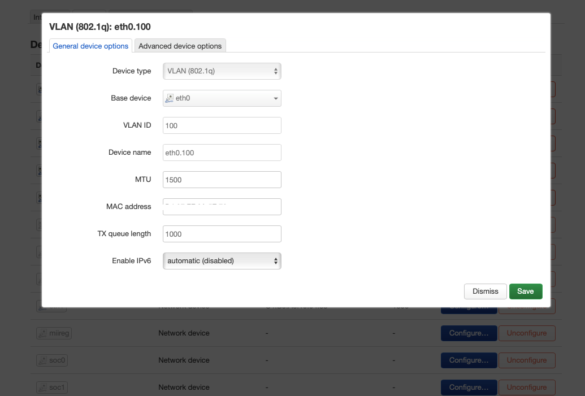

Base device can have different mac than BBox one unlike 802.1q device (it is seen as software VLAN)

Then 

- Go to `Network > Interface > WAN`,  
- click `Edit`,  
- under `General Settings`, select device `eth0.100` (software VLAN),  
- set `Vendor Class to send` to `byteliad`.

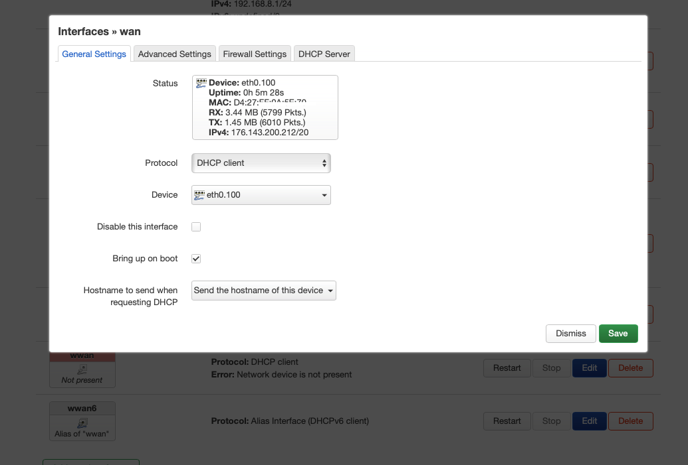

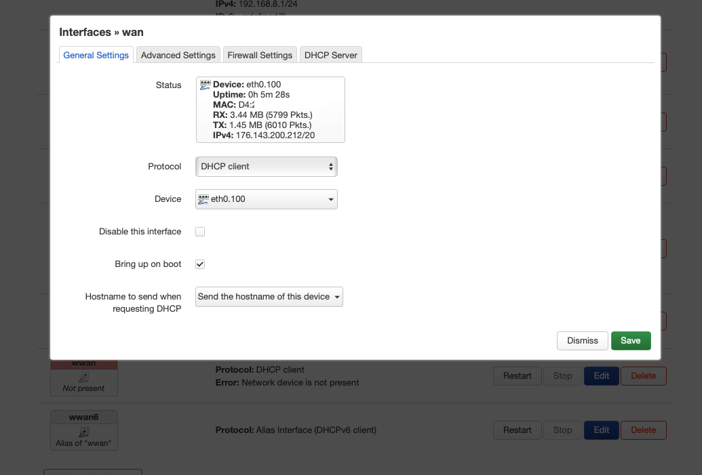

Finally on interface summary page, you will see Interface has N pending change.
Click `Save & Apply`.

We can see VLAN 100 there: http://192.168.8.1/#/internet

We can do this setup in a "dirty way":
- Go to `Network > Interface > Device`.  
- edit eth0 device with mac@
- Go to `Network > Interface > WAN`,  
- set `Vendor Class to send` to `byteliad`, and keep eth0 device 
- And then add And VLAN ID 100 in main page http://192.168.8.1/#/internet
- This will create the network device eth0.100 and we lose capability to set vlan ID in LUCI 
- Actually this config is equivalent fully but better to do it in same interface

### Add IPv6 support

IPv6 address allocation took some time, but it finally came (reboot or unplug all device from ethernet 1 (wan2)-4 could help). 

Here is te configuration in LUCI interface:http://192.168.8.1:8080/cgi-bin/luci/admin/network/network (interfaces)

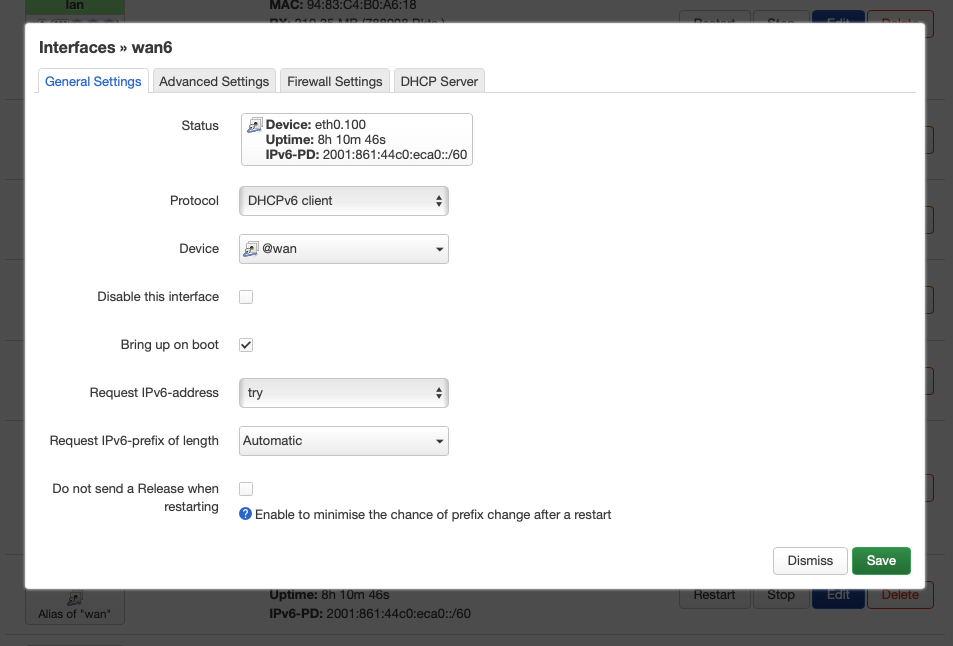

Note `eth0.100` (devices) has field `Enable IPv6` set to automatic (enabled) whereas was automatic (disabled) when no IPv6 interface.

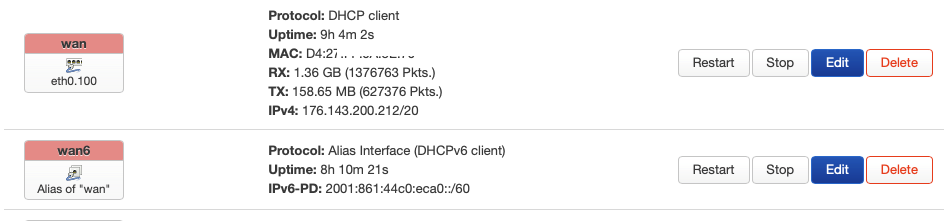

And here is the recap with IPv4 and IPv6 (where clear no [VPN is setup here](./4-deep-dive-vpn-and-routing.md)) @http://192.168.8.1:8080/cgi-bin/luci/admin/status/overview

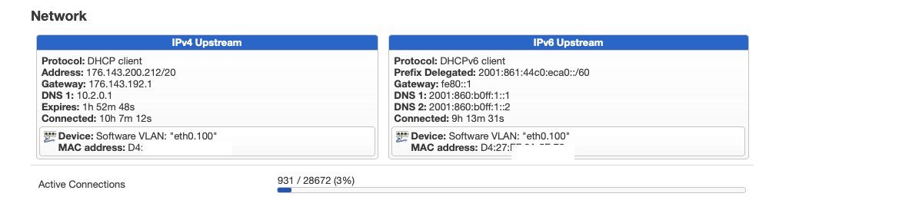

I also enabled in Flint admin page IPv6 with mode native and automatic DNS acquisition method:  http://192.168.8.1/#/ipv6

We can see IPv6 Prefix delegation is `IPv6-PD: 2001:861:44c0:eca0::/60`

See [IPv6 peculiar case](#ipv6-peculiar-case)

Other interesting things is the IPv4 gateway is public. Unlike ipV6 `fe80::1` which is a link-local address.

[See comment on the DNS](./4-deep-dive-vpn-and-routing.md#re-enable-vpn-without-leaking-traffic)

[See change when VPN is enabled or disabled](./4-deep-dive-vpn-and-routing.md#comment-on-interface-after-vpn-setup)

**Here are steps I did to activate IPv6:**
- Ensure IPv6 network is enabled in OpenWRT: http://192.168.8.1:8080/cgi-bin/luci/admin/network/network
- Enable IPv6 in Flint admin page IPv6 with mode native and automatic DNS acquisition method:  http://192.168.8.1/#/ipv6
- Restart IPv6 interface

## Test with various setup 

For out test with flint3 we always have NETWORK ACCELERATION ENABLED (HARDWARE), except when noted otherwise.

### 1: Setup Flint 3 connected with XGS-PON directly and thus bypassing the BBOX

`Fiber —> ONT Nokia —> ETH —>  Flint 3 —> Flint 3 Wifi —> client`

See [how to](#how-to-flint-3-connected-with-xgs-pon-and-thus-bypassing-the-bbox).

https://pic.nperf.com/r/3616263263632627-7WH5AXw5.png

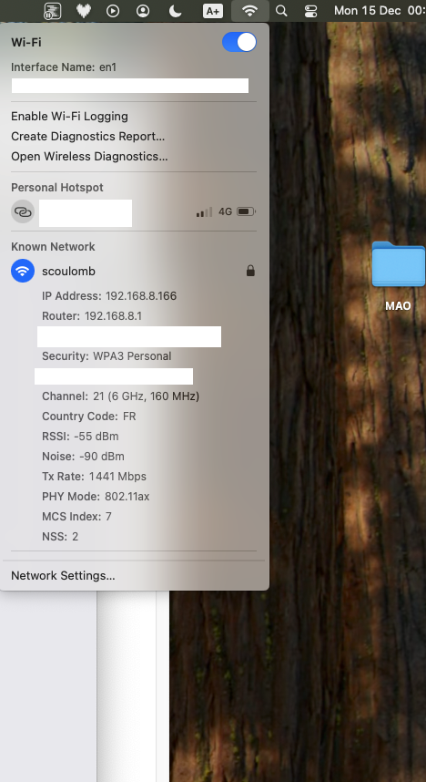

(alt + wifi icon to see details)

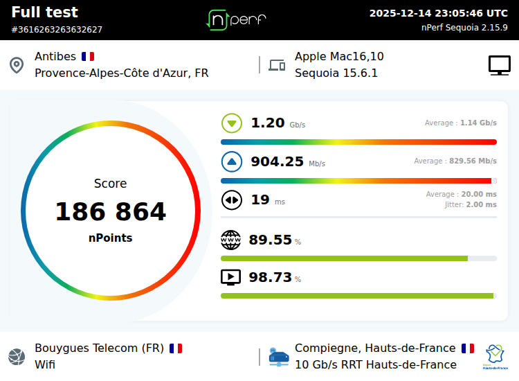

### 2: Same with NETWORK ACCELERATION DISABLED 

https://pic.nperf.com/r/3616264432871142-YuhXREKY.png

### 3: FLINT 3 WIFI CONNECTED TO BBOX and bbox internal XGS-PON

`Fiber —> BBOX (internal ONT) —> ETH —>  Flint 3 —> Flint 3 Wifi —> client`

https://pic.nperf.com/r/3616270326808598-c2rRlcug.png
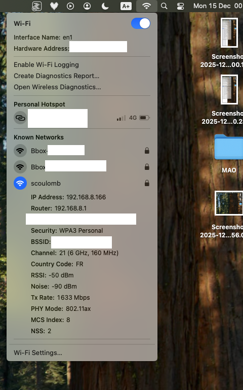
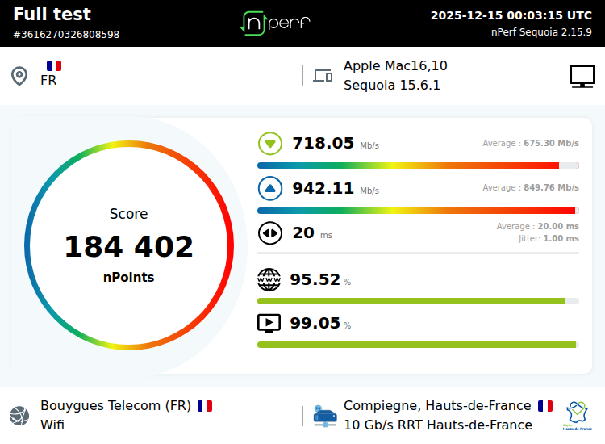

### 4: WIFI BBOX EN DIRECT ET XGS-PON interne

`Fiber —> BBOX (internal ONT) —>  BBOX WIFI Wifi —> client`

https://pic.nperf.com/r/3616267115939080-TdZF1yL4.png

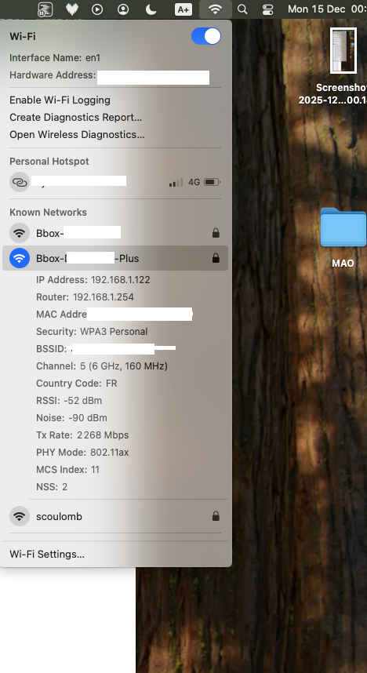
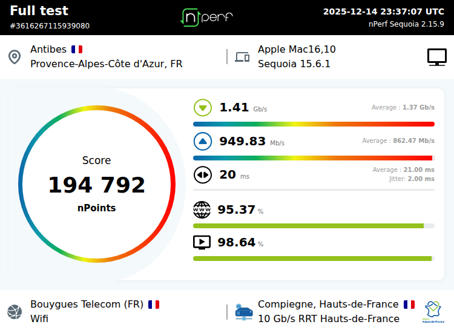

### 5: TEST WIFI BBOX EN DIRECT ET XGS-PON externe

`Fiber —> ONT Nokia -> BBOX —> BBOX WIFI Wifi —> client`

Typique d’un deport de box
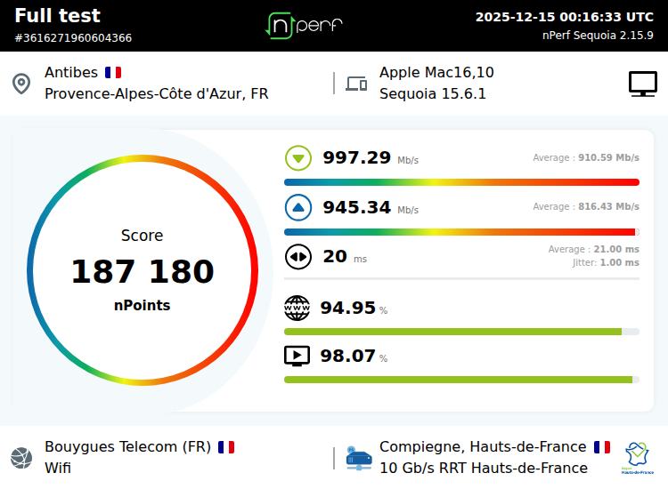

https://pic.nperf.com/r/3616271960604366-k4TrgLsd.png

### 6:TEST WIFI FLINT3 (wire 2.5g flint 3 original, and 1G port of BBOX) to BBOX to XGS-PON externe (via 10G and ugreen cat8 ethernet wire)

`Fiber —> ONT Nokia -> ETH 10G/10G (Ugreen cat 8)  -> BBOX —> ETH 10G/2.5G -> Flint 3 -> Flint3 Wifi —> client`

https://pic.nperf.com/r/3616273691056824-FxV64Hs0.png

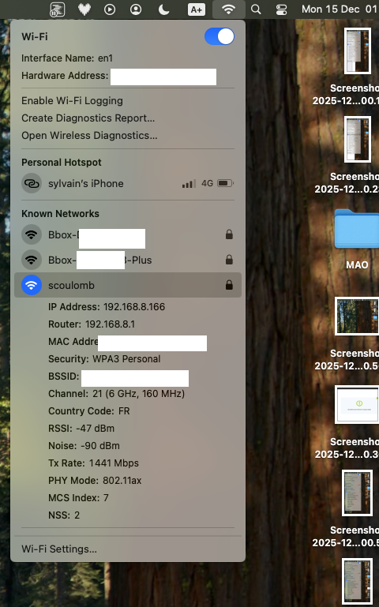

### Key take away 

- Best setup is BBox alone (test 4) - 1.4 gb/s
- Second best is Flint3 connected directly to XGS-PON (test 1) - 1.2 gb/s

- So loss of perf is about 15% when using Flint3 instead of BBox, it is acceptable

- Note BBox can receive 8G with debit+ plan (and has a 10G port, but not used except in case 6)
- Nokia ONT is 10G but plugged to flint3 2.5 g ethernet port. so we have loss
- But given real life comparison loss is low so we can use flint3+external ONT instead of BBox

- Note Bouygues telecom give weirdly better (closer) results with Box why choose Compiegne nperf server.

- I used nPerf app

## IPv6 peculiar case

Setup 3 I got IPv6 (when configured in bbox and activated in flint 3) forwarded.
Will not explore if all layers are traversed now (double NAT equivalent)

## Failover

Idea: Use WAN 1 for XGS-PON and configure LAN 1 as a WAN port connected to the Bbox.  
Test failover by moving the fiber cable from the XGS-PON to the Bbox.  
You will observe the connection switching! (Initially, it did not work—unplugging the Netgear switch resolved the issue.)  
After switching back, Ethernet 2 may show "The interface is connected, but the Internet can't be accessed" (`http://192.168.8.1/#/internet`), while Ethernet 1 becomes active (you may need to unplug the switch again).  
I tested this and it worked as described (and a second time by mistake).

See http://192.168.8.1/#/multiwan

Side note on multi-wan resiliency: [@private-script](../../../notes-temp/Links-mig-auto-cloud/2025-consolidation/multixxx-resiliency/resiliency-disambiguation.md#side-note-on-multi-wan-resiliency)

## Socket establisment direction vs msg flow

Here it is about message flow not socket establishment direction.
-> [@private-script](../../../notes-temp/Links-mig-auto-cloud/2025-consolidation/self-serviceability/External-IP-TCP-socket-establishment-direction-and-message-flow-direction.md)

- Download (descendant): from server to client, message flow is inbound
- Upload (montant): from client to server, message flow is outbound

- ADSL is asymetric
- XGS-PON is symetric unlike GPON

## Note on Fiber path 

1.  **NRO (Nœud de Raccordement Optique)**
    *   This is the main optical node in your area, where the ISP aggregates connections.
    *   Think of it as the local fiber hub for your neighborhood.

2.  **PM (Point de Mutualisation)** (amoire dans la rue)
    *   Located in the street or building basement.
    *   It’s the distribution point where multiple subscribers’ fibers branch out from the main network.

3.  **PBO (Point de Branchement Optique)** (armoire avec compteur (3M)...) <!--mine is labelled PTO but PBO -->
    *   Usually on a pole or in a small box near your home.
    *   It’s the last outdoor junction before the fiber enters your property.

4.  **Drop Cable**
    *   The fiber cable that runs from the PBO to your home.
    *   This is what the technician installs during your fiber activation.

5.  **PTO (Point de Terminaison Optique)** (maison)
    *   Inside your home, where the fiber ends and connects to your ONT or router.

## Note on setup 3 and 6 (in test)

In IPv4 for server setup we would have to configure double NAT or DNZ mode (bridge mode not supported by BBOX),

See [appendices](./appendices/appendix-change-isp.md)

## Summary of wifi 802.11 standard, Wi-Fi (Wifi-6e,7) name and band that can be used

https://www.frandroid.com/comment-faire/241426_les-differentes-normes-wi-fi-802-11abgnac-quelles-differences-pratique

Here is a summary table of the main Wi-Fi (IEEE 802.11) standards, their commercial names, and the frequency bands they use:

| IEEE Standard   | Wi-Fi Name | Max Theoretical Speed | Frequency Bands      | Notes                        |
|-----------------|------------|----------------------|----------------------|------------------------------|
| 802.11b         | Wi-Fi 1    | 11 Mbps              | 2.4 GHz              | Legacy, rarely used          |
| 802.11a         | Wi-Fi 2    | 54 Mbps              | 5 GHz                | Legacy, rarely used          |
| 802.11g         | Wi-Fi 3    | 54 Mbps              | 2.4 GHz              | Legacy                       |
| 802.11n         | Wi-Fi 4    | 600 Mbps             | 2.4 GHz / 5 GHz      | MIMO support                 |
| 802.11ac        | Wi-Fi 5    | 6.9 Gbps             | 5 GHz                | MU-MIMO, wider channels      |
| 802.11ax        | Wi-Fi 6    | 9.6 Gbps             | 2.4 GHz / 5 GHz      | OFDMA, improved efficiency   |
| 802.11ax (6E)   | Wi-Fi 6E   | 9.6 Gbps             | 2.4 / 5 / 6 GHz      | Adds 6 GHz band              |
| 802.11be        | Wi-Fi 7    | 46 Gbps (theoretical)| 2.4 / 5 / 6 GHz      | Multi-link, 320 MHz channels |

- **Wi-Fi 6E** is the first to use the 6 GHz band, in addition to 2.4 and 5 GHz.
- **Wi-Fi 7** (802.11be) further improves speed and latency, using all three bands and wider channels.

Bands:
- **2.4 GHz**: Longer range, more interference, lower speeds.
- **5 GHz**: Shorter range, less interference, higher speeds.
- **6 GHz**: Shortest range, least interference, highest speeds (Wi-Fi 6E/7 only).

Our tests were done on mac mini (802.11ax).

We can understand why on flint 3 we can select per band, the IEEE standard.
In 6GHz we can only use 802.11ax (Wi-Fi 6E) and 802.11be (Wi-Fi 7).

See http://192.168.8.1/#/wireless

## See links with VPN dojo

See 
[@private-script](../../../notes-temp/Links-mig-auto-cloud/2025-consolidation/Dojos/VPN-Dojo/VPN-dojo.md)
[@private-script](../../../notes-temp/Links-mig-auto-cloud/2025-consolidation/Dojos/VPN-Dojo/about-nat-at-home.md)

<!-- What is in appendices was initially in this dojo folder -->

## Deep dive on IPv6

Given [IPv6 setup in flint3 router with BYTEL](#add-ipv6-support), let's deep dive into IPv6.

## Deep dive on VPN and routing

See [deep dive VPN and routing](4-deep-dive-vpn-and-routing)

## External access

Given I keep setup from test 1 (Flint3 connected directly to XGS-PON bypassing BBOX).
What is described in [external access readme](../external-access/README.md) still apply.

<!-- all above is ccl just cross reference in private_script  -->

See also: https://www.frandroid.com/produits-android/maison-connectee/routeur/2575449_jai-remis-la-bbox-dans-son-carton-reprendre-le-controle-de-son-internet-en-remplacant-sa-box

Tips: Disable 2.4 for HEOS to connect to 6g or do specific SSID

<!-- ccl OK -->

## Additional note on Ethernet wire

In [case 6](#6test-wifi-flint3-wire-25g-flint-3-original-and-1g-port-of-bbox-to-bbox-to-xgs-pon-externe-via-10g-and-ugreen-cat8-ethernet-wire)

I detailed the wire used to connect the various devices.

- UGREEN Cat 8 Network Ethernet Cable RJ45 Super Speed 40Gbps 2000MHz Nylon
- Flint 3 wire (pic router is proof https://store.gl-inet.com/products/flint-3-gl-be9300-tri-band-wi-fi-7-home-router ) which is cat 6 (confirmed)

- All other test made with uGreen wire (and eventually flint3 wire).

Here is table of Ethernet cable categories:

Here is a table summarizing Ethernet cable categories and their maximum speeds:

| Category   | Max Speed         | Max Bandwidth | Max Length (at max speed) | Shielding      | Typical Use Cases                |
|------------|-------------------|---------------|---------------------------|----------------|----------------------------------|
| Cat 5      | 100 Mbps (Fast)   | 100 MHz       | 100 m                     | UTP            | Legacy, basic networking         |
| Cat 5e     | 1 Gbps (Gigabit)  | 100 MHz       | 100 m                     | UTP/STP        | Standard home/office networks    |
| Cat 6      | 1 Gbps (up to 55m), 10 Gbps (up to 37m) | 250 MHz | 100 m (1 Gbps), 37 m (10 Gbps) | UTP/STP | High-speed LAN, short 10G links  |
| Cat 6a     | 10 Gbps           | 500 MHz       | 100 m                     | UTP/STP        | Data centers, enterprise         |
| Cat 7      | 10 Gbps           | 600 MHz       | 100 m                     | S/FTP          | Data centers, shielded networks  |
| Cat 8      | 25/40 Gbps        | 2000 MHz      | 30 m                      | S/FTP          | Data centers, short 25/40G links |

- UTP: Unshielded Twisted Pair
- STP: Shielded Twisted Pair
- S/FTP: Shielded/Foiled Twisted Pair

Cat 8 is mainly for short, high-speed connections in data centers. For most home/office use, Cat 5e, Cat 6, or Cat 6a is sufficient.

So cat 6 is ok, at it already has 10-gb/s support under 37m length.

I will rewire potentially with cat 8.

<!-- this addition is ccl OK-->