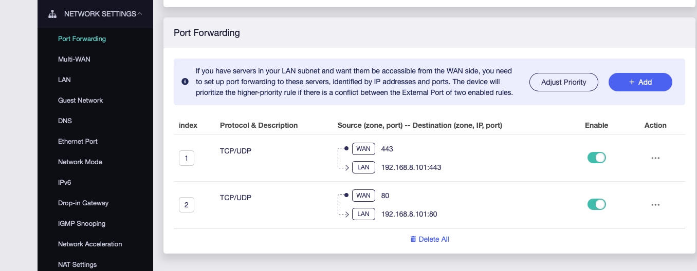
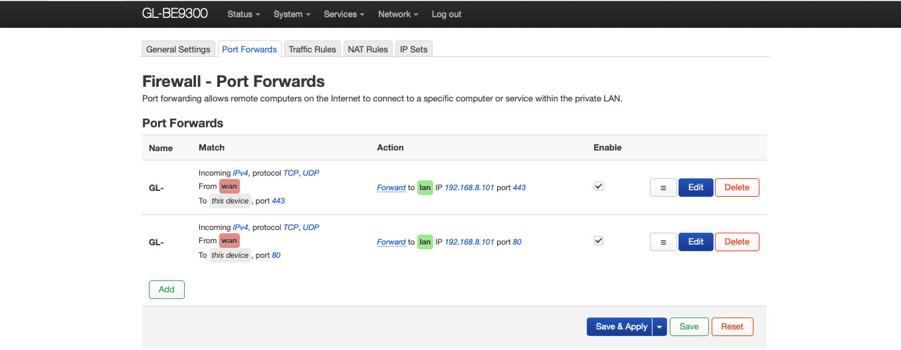
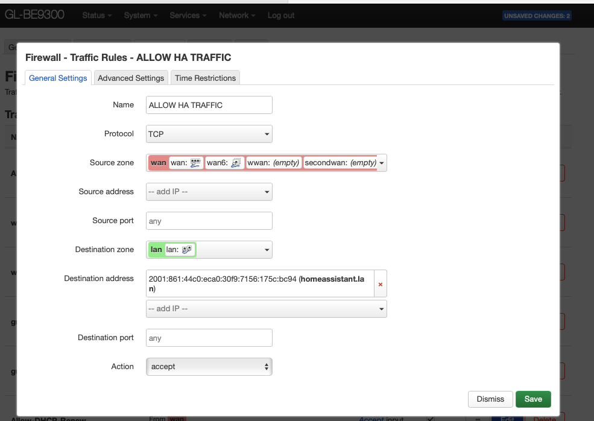
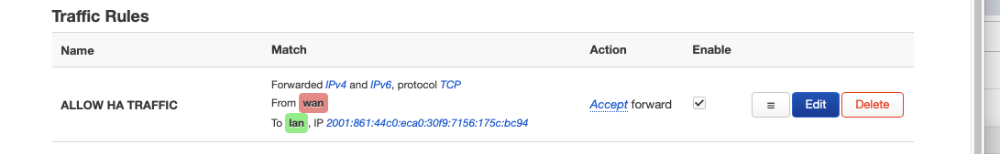
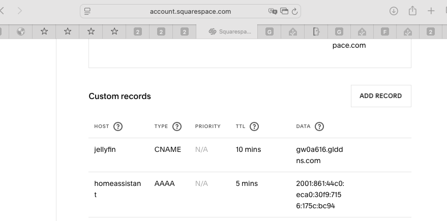
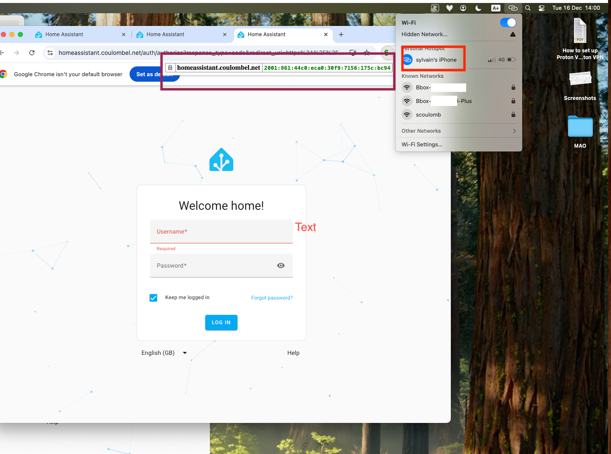
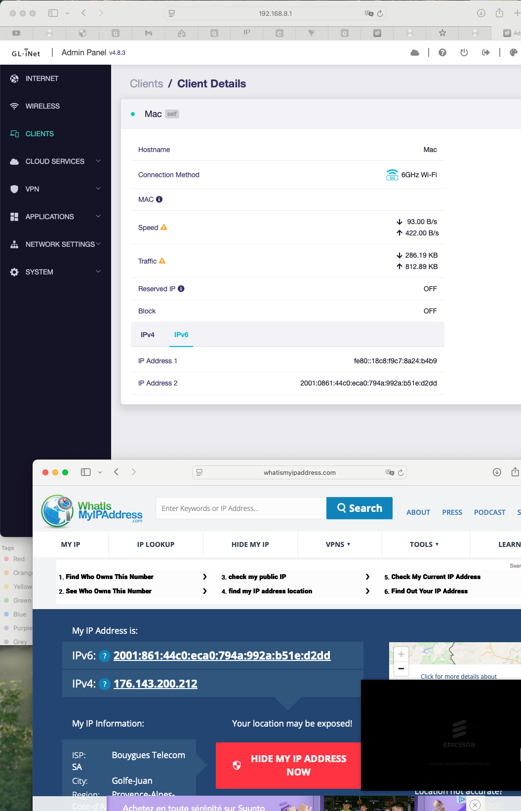
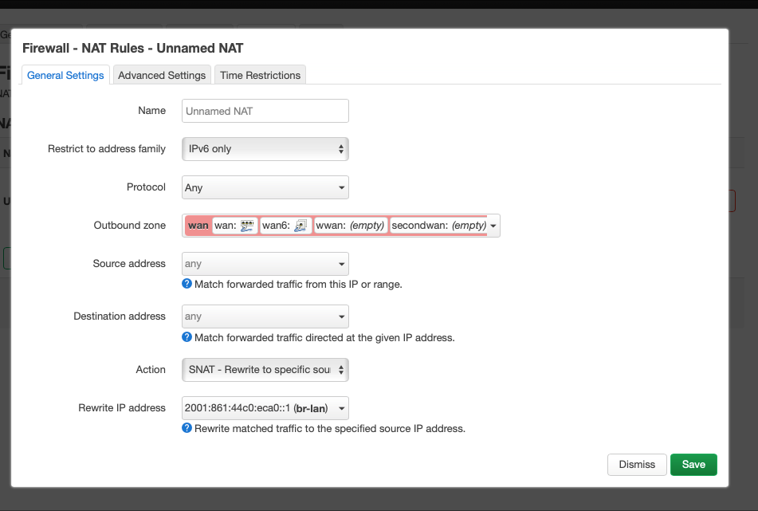
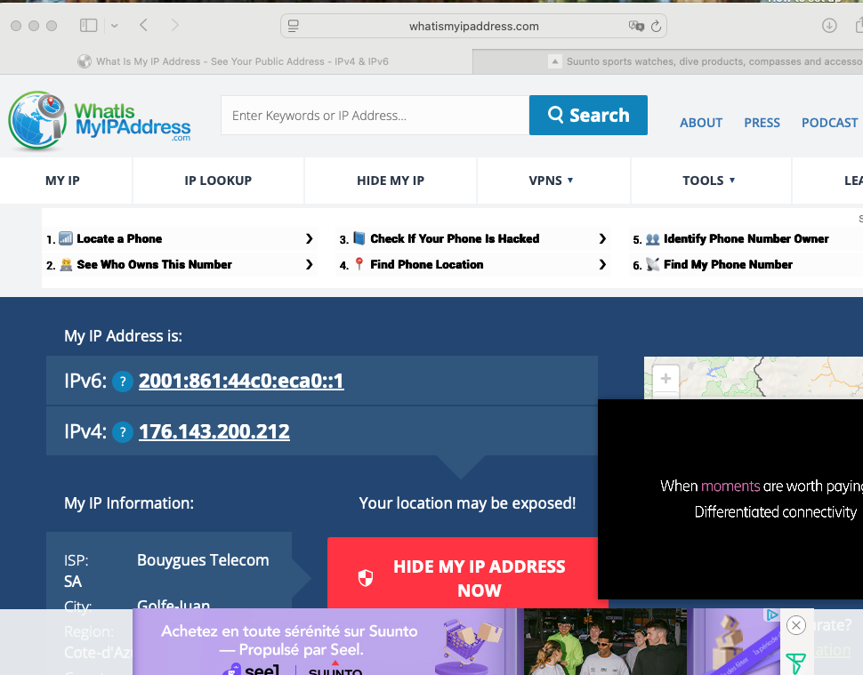

# Deep dive on IPv6

See [previous reference in this document](./2-Flint3-router-setup-BYTEL.md#deep-dive-on-ipv6)

## **Note on Firewall in OpenWrt LuCI**

- The **Firewall** tab in LuCI manages network security between zones (e.g., LAN, WAN).
- **Port Forward** is for DNAT (Destination NAT), forwarding external ports to internal devices.
  - Note needed for IPv6 as each device has its own IP (prefix delegation like subnet in TAN:  /private_script /2025-consolidation/deep-dive-routing/README.md)
- **NAT Rules** are for SNAT (Source NAT), 
  - mainly used for IPv4 to mask internal IPs when accessing the internet.
- **Traffic Rules** define firewall rules for both inbound and outbound traffic.
  - The **General Settings** section lets you define zones (network segments).
- **IP Sets** allow you to group IP addresses or networks for use in rules.

With IPv4 and NAT, your internal network structure is hidden because all outbound traffic appears
to come from the router’s public IP, and inbound connections are blocked unless explicitly forwarded.

With IPv6, devices get public addresses, so the internal architecture is more visible to the internet. 
However, your firewall still protects devices by blocking unsolicited inbound connections. 

You can control exposure with strict firewall rules, but the address structure itself is not hidden as with IPv4 NAT.


Note on IPv6 we have:
- A public IPv6 address is globally routable on the internet, unlike link-local or ULA addresses.
- If your device receives a public IPv6 address (typically starting with `2xxx:` or `3xxx:`),
- it can be accessed from outside your local network, 
- provided your firewall allows it. 
- ISPs like Bouygues usually delegate a public IPv6 prefix (e.g., `/60`) to your router,
- which then assigns public IPv6 addresses to devices on your LAN.


See private_script  / 2025-consolidation/global-appendice/FW-magic-

## How to configure external access with IPv6

### Reminder with IPv4

#### General

In [external access](../external-access/README.md#method-3-use-ha-proxy-) we see how to use HA proxy for external access and how we use DNAT/forwarding rules with IPv4.

So we did:

````shell
client -> WAN IP:443/80  ---BOX NAT --> Raspberry PI 5 IP :443/80 (Port NGINX proxy manager - HomeAssistant add-ons) --> Raspberry PI 5: 8123 (HomeAssistant)
````

So if we take HomeAssistant client, let's find its IPs: http://192.168.8.1/#/clients

We have 
- Direct access to HA: http://192.168.8.101:8123 (OK working)
- To proxy: http://192.168.8.101:80 (nginx page as no Host header)
- To proxy in TLS: https://192.168.8.101:443 (not directly accessible as no Host header)

#### IPv4 without HA proxy

So if we were not using a HA proxy, we would need to do port forwarding in the Flint3-router directly to 8123.

With an HA proxy we do port forwarding to the HA proxy (nginx proxy manager) listening on 80/443 and then it forwards to 8123 based on Host header.

#### IPv4 with HA proxy

So here we defined http://192.168.8.1/#/firewallview this config



And equivalently in LuCI:



We configure NGINX proxy for domain `coulombel.net` with TLS certificate from Let's Encrypt.


With DNS pointing to public IPv4 address via DynDNS

```text
scoulomb@Mac ~ % nslookup homeassistant.coulombel.net
Server:		2001:861:44c0:eca0::1
Address:	2001:861:44c0:eca0::1#53

Non-authoritative answer:
homeassistant.coulombel.net	canonical name = gw0a616.glddns.com.
Name:	gw0a616.glddns.com
Address: 176.143.200.212
```

(we could need DNS defined before for validation of Let's Encrypt certificate, but here I described order in the network flow)


We can test there that it is working 

http://homeassistant.coulombel.net 
https://homeassistant.coulombel.net  


### Let's now do the equivalent with IPv6

#### General

We have 2 IP@ for HomeAssistant / Raspberry PI device.

- Link local IPv6: fe80::xxxx:xxxx:xxxx:xxxx
- Public IPv6: 2a01:e34:ec8a:xxxx:xxxx:xxxx:xxxx:xxxx

If we do 

- Direct access to HA: http://[fe80::3bdc:bf4e:ebc5:3aba]:8123  (OK working)
- To proxy: http://[fe80::3bdc:bf4e:ebc5:3aba] (nginx page as no Host header)
- To proxy in TLS: https://[fe80::3bdc:bf4e:ebc5:3aba] - not directly accessible

with IP address 2

- http://[2001:0861:44c0:eca0:30f9:7156:175c:bc94]:8123 (OK working)
- http://[2001:0861:44c0:eca0:30f9:7156:175c:bc94] (nginx page as no Host header)
- https://[2001:0861:44c0:eca0:30f9:7156:175c:bc94] - not directly accessible
 
#### IPv6 without HA proxy

Note that if we do
http://[2001:0861:44c0:eca0:30f9:7156:175c:bc94]:8123 - in our LAN it is working directly

However, when accessing from a 4G network, it does not work.  
A firewall rule must be configured to allow external access.




And with that rule, it is working from outside.

This is equivalent to a DNAT /port forward rule to 8123  in IPv4 => [IPv4 without HA proxy](#ipv4-without-ha-proxy)

#### IPv6 with HA proxy


Now objective would be to use Home Assistant via HA proxy in IPv6 !!
As we did here [IPv4 with HA proxy](#ipv4-with-ha-proxy).

Change DNS to point to the public Ipv6 of HomeAssistant



(You can not define A and AAAA record with same host)

And check DNS applied

````
scoulomb@Mac ~ % nslookup homeassistant.coulombel.net 8.8.8.8            
Server:		8.8.8.8
Address:	8.8.8.8#53

Non-authoritative answer:
*** Can't find homeassistant.coulombel.net: No answer

scoulomb@Mac ~ % nslookup -type=AAAA  homeassistant.coulombel.net 8.8.8.8
Server:		8.8.8.8
Address:	8.8.8.8#53

Non-authoritative answer:
homeassistant.coulombel.net	has AAAA address 2001:861:44c0:eca0:30f9:7156:175c:bc94

Authoritative answers can be found from:

````
And validate https://homeassistant.coulombel.net is working win ipv6 externally via the proxy.



Where we can see we 
- Are in 4G network (I check and WiFi disabled in iPhone, actually it can not receive Wi-Fi and be an access point at the same time, so we are safe in the conclusion)
- Accessing https://homeassistant.coulombel.net resolving to IPv6 thanks to chrome http://code.google.com/p/ipvfoo/ plugin 

If I disable the firewall rule, external access does not work.  
Home Assistant displays a message while preloading: "Unable to fetch auth providers. https://homeassistant.coulombel.net/?auth_callback=1" (showing connextion cut, in private window you will have can not load page).

Ideally, the firewall rule should be refined to only allow ports 443 and 80.

I reverted to the initial configuration by updating the DNS settings.

In [4 deep dive VPN and routing](./4-deep-dive-vpn-and-routing.md) we will not see how to access Home Assistant via VPN, but how to use OpenWRT with a public VPN.

We will also dive more on [firewall rules in OpenWRT LuCI.](#note-on-firewall-in-openwrt-luci).


## In theory we could also do equivalent of DNAT / port forwarding rule we did in IPv4 in IPv6

In IPv4 we did port forwarding to HA proxy (nginx proxy manager) listening on 80/443 and then it forwards to 8123 based on Host header.

In IPv6 we show it was not needed as each device has its own public IP, and configure firewall rule.

Could we also do port forwarding / DNAT rule in IPv6 ?

In theory yes with port forward: http://192.168.8.1:8080/cgi-bin/luci/admin/network/firewall/forwards

To forward all traffic reaching router to HA IPv6 IP. But not managed to make it work in practise.

## IPv4/IPv6 and SNAT


Unlike IPv4 where we expose a single public IP via default SNAT: `176.143...`
In IPv6 each device can have its own public address (with a shared prefix). So here what we exposed outside is IPv6 IP of the mac mini device. 




We see we expose IP of home assistant device, where beginning of the IP is our Prefix delegation:
[IPv6-PD: 2001:861:44c0:eca0::/60`](2-Flint3-router-setup-BYTEL.md#add-ipv6-support).

---

We can also setup SNAT rules in LuCI if needed 

- But quite limited if we have only one public IPv4 IP)
- However in IPv6 this SNAT would allow to hide internal infra.

We can configure in SNAT rules in LuCI Firewall/NAT rules tab: http://192.168.8.1:8080/cgi-bin/luci/admin/network/firewall/snats





This refers to [note above](#note-on-firewall-in-openwrt-luci).

In general (private_script, prezNewGen), I say exposed public IP, SNAT IP as synonym but in IPv6 if we do not this SNAT rule, it is correct to say exposed IP but SNAT IP would be incorrect.


<!--all this IPv6 is concluded 
including the DNAT/SNAT and co comparison -- Never come back here -17dec25 20:03
OK-->


