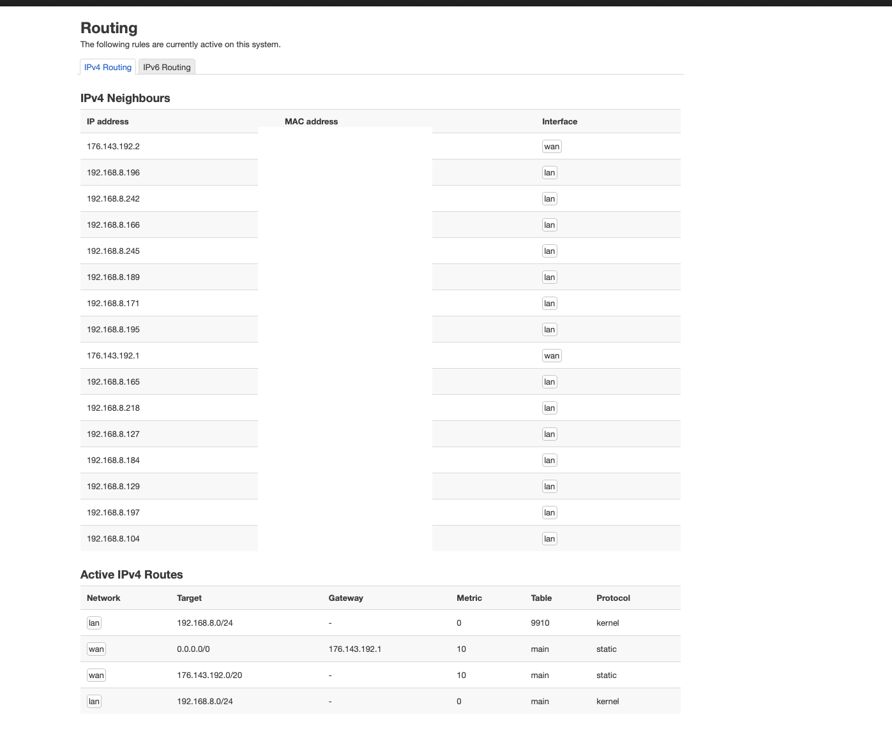
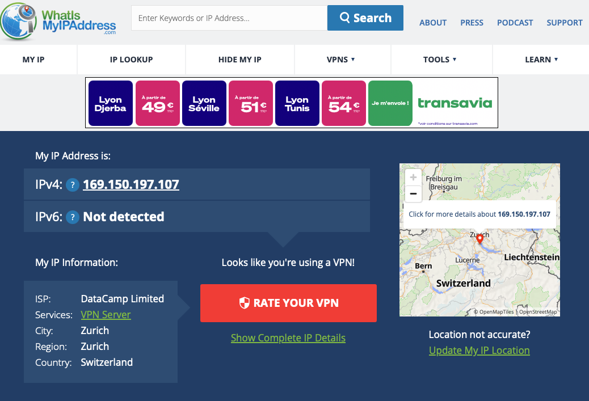
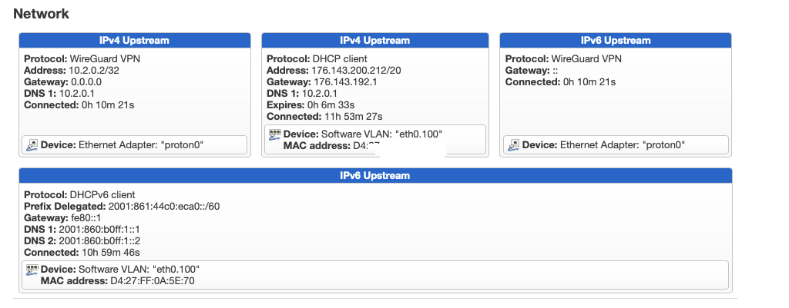
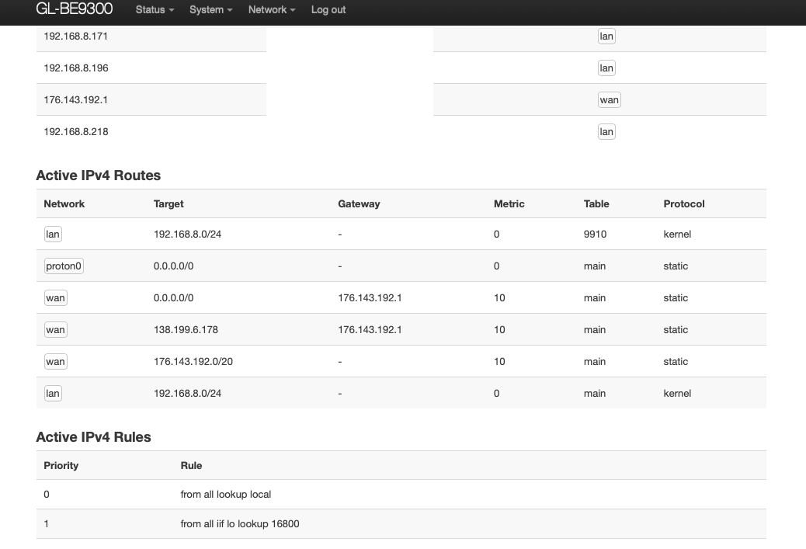
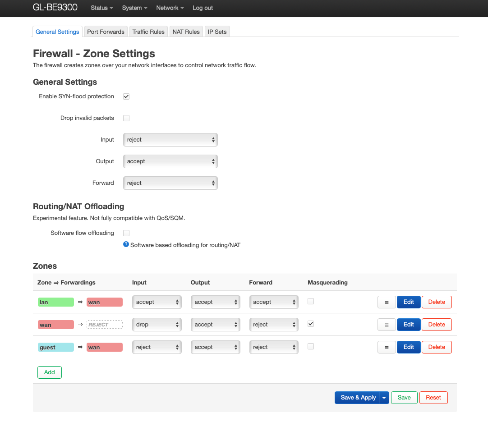
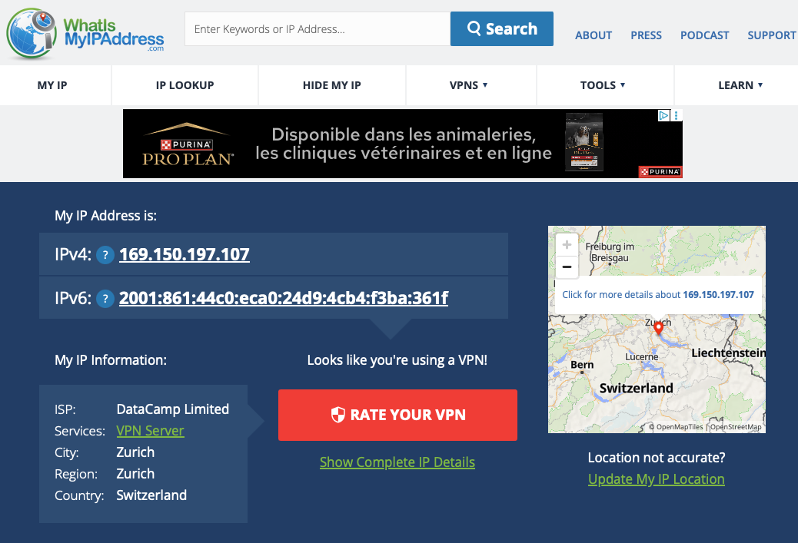

# Setup VPN with flint 3 router

In [4 deep dive VPN and routing](./4-deep-dive-vpn-and-routing.md) we will not see how to access Home Assistant via VPN,
but how to use OpenWRT with a public VPN.

We will also dive more on [firewall rules in OpenWRT LuCI see before](3-deep-dive-on-ipv6.md#note-on-firewall-in-openwrt-luci).

See private script - 2025-consolidation/Dojos/VPN-Dojo/VPN-dojo.md

> - As reminder from https://github.com/scoulomb/home-assistant/blob/main/appendices/VPN.md#netflix-and-vpn
> - We can have a VPN for 
>  - VPN to connect to remote local network with encryption (1a private network with a customer)
>  - And have SNAT IP address different from your ISP SNAT IP (side effect of remote local network) 
>    - (this is the use-case sold by VPN provider: NordVPN…..)

We are here in the second use-case.

## Let's observe the routing table before VPN setup 

http://192.168.8.1:8080/cgi-bin/luci/admin/status/routes



Note also the config 

Here is a clearer structure for the WAN configuration:

```
WAN

- Protocol: DHCP
- IP Address: 176.143.200.212
- Gateway: 176.143.192.1
- DNS Server: 194.158.122.10, 194.158.122.15
```

We can see our gateway here is assigned a public address by our ISP (Bouygues) as noticed in [3 deep dive on IPv6](3-deep-dive-on-ipv6.md#reminder-with-ipv4).
Unlike in IPvy where gateway is `fe80::1` link-local address.

See [2-Flint3-router-setup-BYTEL.md](./2-Flint3-router-setup-BYTEL.md#add-ipv6-support)

## Setup VPN client on OpenWRT LuCI


Followed https://protonvpn.com/support/openwrt-wireguard

See [Proton VPN](./4-deep-dive-vpn-and-routing-media/protonVPN-wireguard.pdf)

## Comment on setup

At step , sub-step 8, I did not lose Internet access because I was assigned an [IPv6 address](3-deep-dive-on-ipv6.md).  
The "What is my IP" : https://whatismyipaddress.com/ service showed only an IPv6 address, with no IPv4.  
I disabled the IPv6 interface to return to the nominal situation of the tutorial where the Internet was not working (because we have only IPv4 interface and firewall rules not configured).

When procedure is executed, we have Internet access again and SNAT IPv4 is VPN one.



Note here we configured VPN directly with LUCI GUI interface.
We did not use Flint3 router feature: http://192.168.8.1/#/wgclient, which offers equivalent functionality. (that I tried)
Also not config made in LUCI is not retrofitted to Flint 3 interface....
Same the VPN IP is not retrofitted in flint3 inteface: http://192.168.8.1/#/internet.  

## Comment on interface after VPN setup

In OpenWRT LuCI, we can see the VPN interface.

Here we can see Interface proton0: http://192.168.8.1:8080/cgi-bin/luci/admin/network/network

````
proton0

Protocol: WireGuard VPN
Uptime: 0h 19m 0s
RX: 37.10 MB (58821 Pkts.)
TX: 12.40 MB (28236 Pkts.)
IPv4: 10.2.0.2/32
````

`IPv4: 10.2.0.2/32`: It’s the local IPv4 address assigned to our WireGuard tunnel interface.
10.2.0.2/32 is a private (RFC1918) address used inside the VPN tunnel; /32 means a single host/point‑to‑point.
It is not our public IP. Our public egress IP is the VPN server’s address (the one websites like  https://whatismyipaddress.com/,  see).

Note when VPN interface is disabled (or not) WAN(4) interface is (proof interface does not change based on VPN interface activation [2-Flint3-router-setup-BYTEL.md](./2-Flint3-router-setup-BYTEL.md#add-ipv6-support))
<!-- I recheck this and I can confirm this, and recheck 18 dec 25 (note can check this with no risk if firewall not allowing VPN traffic see below -->

```text
WAN(4)

Protocol: DHCP client
Uptime: 19h 27m 12s
MAC: D4:27:...(mac of BBOX set in eth0.100 interface)
RX: 4.89 GB (4468515 Pkts.)
TX: 1.39 GB (2571937 Pkts.)
IPv4: 176.143.200.212/20
```

And WAN6 interface is

```
WAN6

Protocol: Alias Interface (DHCPv6 client)
Uptime: 18h 34m 26s
IPv6-PD: 2001:861:44c0:eca0::/60
```

It also means that here (in the GUI) interface WAN(4) **when VPN interface is disabled**, here it displays IP website sees 
(https://whatismyipaddress.com/) 
See evidence here when we [revert to initial configuration without VPN](#revert-to-initial-configuration) below.

**when VPN interface is Enabled**, it substitutes WAN4 interface/on top when enabled (VPN should see our WAN4 SNAT IP).
The VPN interface which shows the WireGuard tunnel interface and not the public VPN egress SNAT IP.

And for WAN6 interface, when enables it shows the IPv6 prefix which is used, here we have no VPN for IPv6.
-> see [comment on setup](#comment-on-setup)

See recap when using a VPN provider with IPv4 (and IPv6 interface enabled) @http://192.168.8.1:8080/cgi-bin/luci/admin/status/overview



<!-- ok doubt but clear -->

## Routing table after VPN setup


We can see the routing
http://192.168.8.1:8080/cgi-bin/luci/admin/status/routes




Here static routes are empty: http://192.168.8.1:8080/cgi-bin/luci/admin/network/routes


## Note on IPv6 interface and VPN

Note: after a router restart, if the IPv6 interface comes up (option bring up on boot enabled)
it is still blocked by the firewall rules allows only forwarding `LAN => VPN` @http://192.168.8.1:8080/cgi-bin/luci/admin/network/firewall

Because I had added the VPN zone, and allow zone forwarding  `LAN => VPN` (so it implicitly updated the LAN zone).

As there was already the forward zone `LAN => WAN`,

We had:

`LAN => VPN and WAN`

So we edited the existing LAN zone, to only keep the forward `LAN => VPN` (and add MSS clamping), as described in tuto (step 4, sub-step 3) (ensuring all traffic goes through VPN).


See the default general settings after a reset



Here is a good explanation of forwarding zone: https://objnux.fr/index.php?post/2021/12/18/OpenWrt-Pare-feu and save [here](./4-deep-dive-vpn-and-routing-media/OpenWrt-Pare-feu-objectif-NUX.pdf)

Note the forwarding not in color are deduced from general settings. <!-- no dive more -->

## Revert to initial configuration

Revert to initial configuration
1. Open the LuCI network interfaces page: http://192.168.8.1:8080/cgi-bin/luci/admin/network/network
2. Re‑enable the IPv6 interface (if desired).
3. Disable the `proton0` interface.
4. Open the LuCI firewall zones page: http://192.168.8.1:8080/cgi-bin/luci/admin/network/firewall/zones
5. Remove the rule `LAN => VPN` (optional as no risk) and ensure we set back to `LAN => WAN` if was removed (in LAN zone can untick MSS clamping if added but no side effect anyway).
6. Reminder if both are kept it is shown in same line `LAN => VPN and WAN`.
7. Network → Interfaces → wan → Edit → advanced settings, remove custom DNS 10.2.0.1 if added, instead use DNS advertised by peers, meaning DHCP (ISP one)

Note the DNS is a private one, so when TTL expires it will query DNS again, and issue if not set to ISP one.

Whatismyipaddress.com should now show your original public IP address again.

```text
IPv6: ? 2001:861:44c0:eca0:580e:1354:8b72:e92c
IPv4: ? 176.143.200.212
```

Comment: this is the exposed IP of the MAC MINI (see [3 deep dive on IPv6](3-deep-dive-on-ipv6.md#ipv4ipv6-and-snat)).
<!-- IP different here as I reset my router but still same PD -->


- At step 5: if we keep both rules: `LAN => VPN` and `LAN => WAN`.
- When the VPN is enabled, the `proton0` (VPN) interface replaces the `WAN (4)` interface/come on top, so no rule change is required.
- This removes an extra manual change step.
- However, note the following:
  - When `wan6` and `proton0` are enabled and the firewall keeps both forwards
  - `LAN => VPN and WAN` (including `WAN4` and `WAN6`, or a zone limited to `WAN6`),
  - IPv4 egress uses the VPN address while IPv6 egress uses the public ISP address.
- As shown here



<!-- (Redid the test, whatismyIP site reversed ipv6 and ipv4 but same ip) -->

## Re-enable VPN without leaking traffic

Thus to re‑enable the VPN without leaking traffic outside the VPN - Method 1:

- Disable `wan6`.
- Enable `proton0`.
- Allow zone `LAN => VPN` (keeping `LAN => WAN` is safe since `wan6` interface is disabled so no lan => wan6 is possible and `proton0` takes over `WAN (4)`).
  - Ensure MSS clamping is enabled
- Network → Interfaces → wan → Edit, add custom DNS 

Or (more secure, preferred) - Method 2:

- Keep `wan6` enabled.
- Enable `proton0`.
- Allow zone `LAN => VPN` only.
  - Ensure MSS clamping is enabled
- Network → Interfaces → wan → Edit, add custom DNS 

Whatismyipaddress.com should now show your original public IP address again.

```text
IPv4: ? 169.150.197.107
IPv6: ? Not detected
```

This is safer for router restart and where interface are started automatically.
This is the use-case in [note-on-ipv6-interface-and-vpn](#note-on-ipv6-interface-and-vpn).

<!-- => I tested it several times both and working as described -->

And to remove VPN in both case
- `wan6` enabled (as `WAN(4)`) (nothing to do in method 2)
- Disable `proton0` interface.
- Allow zone `LAN => WAN` only (but would not harm to keep `LAN => VPN` as proton0 is disabled). (nothing to do in method 1)
  - Can disable MSS clamping (optional)
- Network → Interfaces → wan → Edit, remove custom DNS if added


In [IPv6 support enabling](./2-Flint3-router-setup-BYTEL.md#add-ipv6-support) I had kept proton VPN custom DNS when disabling proton0 interface.
<!-- both markdown 2, 3 and 4 worked in parallel -->

<!-- all above is concluded intermediate 18 dec 25 -11:40 am clear done -->

## Routing

### Analysis of routing table before and after VPN setup


We can see gateway and IP@ are same as [before VPN setup](#lets-observe-the-routing-table-before-vpn-setup-)and confirm [comment here](#analysis-of-routing-table-before-and-after-vpn-setup)).

Before VPN setup we have the rule on WAN network 
- `0.0.0.0/0` -> `176.143.192.1` with metric 10 (ISP gateway, which is a public IP)
After VPN setup we have the new route on proton0 network
- `0.0.0.0/0` -> `-` with metric 0 (“–” indicates no extra hop; the router knows the destination is reachable via its own interface.)

Note the concept of metric in routing table here.

Note `/0` means default route (all IPs).
A route with prefix /0 (0.0.0.0/0 in IPv4 or ::/0 in IPv6) is actually the least specific route!


### Metric?

Cisco IOS and OpenWrt use the concept of a **metric** in routing, but they apply it differently depending on the protocol:

#### **On OpenWrt**

*   The metric is a **priority value** for routes in the routing table.
*   Lower metric = higher priority.
*   It’s commonly used for static routes and policy-based routing.
*   For example, if you have two default gateways, the one with metric `10` will be preferred over metric `20`.

#### **On Cisco IOS**

*   Cisco also uses metrics, but the term and behaviour depend on the routing protocol:
    *   **Static routes**: You can set an **administrative distance (AD)**, which determines preference between sources (e.g., static vs OSPF vs BGP).
    *   **Dynamic protocols**:
        *   **OSPF** uses **cost** (based on bandwidth).
        *   **EIGRP** uses a composite metric (bandwidth + delay).
        *   **BGP** uses attributes like **AS Path**, **Local Preference**, etc.
*   So, Cisco does not have a single “metric” field like OpenWrt; it’s protocol-specific.

#### **Key Difference**

*   OpenWrt metric = simple numeric priority for routes.
*   Cisco metric = protocol-dependent calculation, plus AD for route source preference.

#### So we have: 

- Longest prefix match (most specific route)
- If tie → Compare metric on OpenWRT / Compare Administrative Distance (between protocols) in Cisco IOS
- If still tie → Compare protocol-specific metric or BGP attributes on Cisco IOS

See links with [[@ private-script](../../../notes-temp/Links-mig-auto-cloud/2025-consolidation/deep-dive-routing/README.md)


### Now testing PBR (policy-based routing):


Use pbr and luci\-app\-pbr to route only selected clients through the VPN.
Reference: https://superuser.com/questions/1785807/how-to-make-openwrt-only-route-some-clients-through-a-vpn
LuCI: http://192.168.8.1:8080/cgi-bin/luci/admin/services/pbr
Note: linked DL firewall SNAT for policy routing.

Result: could not get it working. Will not spend more time on this in 2025.

This is similar to [PBF](../../../notes-temp/Links-mig-auto-cloud/2025-consolidation/global-appendice/FW-magic-beyond-filtering-ie-snat.md#3c2-solution-policy-based-forwarding-pbf)

## VPN on machine and VPN on router combination (double VPN)

See VPN dojo notes:
- [@private-script](../../../notes-temp/Links-mig-auto-cloud/2025-consolidation/Dojos/VPN-Dojo/VPN-dojo.md#plan-and-double-vpn-topology-analysis)
- [@private-script](../../../notes-temp/Links-mig-auto-cloud/2025-consolidation/Dojos/VPN-Dojo/about-nat-at-home.md)

nskope is not a traditional vpn (as does not route all traffic c through a single encrypted tunnel like a VPN but what said on combo OK) . 

Note Icloud private relay is not a full VPN as per https://support.apple.com/en-us/HT212614

iCloud Private Relay routes your internet traffic through two separate relays:  
1. The first relay (operated by Apple) knows your IP address but not the website you visit.  
2. The second relay (operated by a third party) assigns you a temporary IP and forwards your request to the destination site, hiding your real IP and DNS from the site.

**Differences from a full VPN:**
- Private Relay only works with Safari and some Apple apps, not all device traffic.
- It does not allow you to choose your exit country or region.
- It does not provide the same level of anonymity or location spoofing as a VPN.
- It is designed for privacy, not for bypassing geo-restrictions or accessing remote networks.  
- A full VPN encrypts and routes all device traffic through a single server, masking your IP and location for all apps and protocols.

We can add perso vpn (own vpn server ir external) + private relay + corp (nskope) 
<!-- assume good order -->


## What about firewall rules priority 

([metric](#metric) equivalent for firewall rules.

Here’s the **final recap including Azure Firewall** alongside Palo Alto and OpenWrt, focusing only on **security rule priority**:


### **Palo Alto Networks**

*   **Priority Mechanism**:
    *   Security rules are evaluated **top-to-bottom** in the rulebase.
    *   No numeric priority field; position determines precedence.
*   **Evaluation Order**:
    1.  **Pre-rules** → **Local rules** → **Post-rules**.
    2.  Within each section, first match wins.
*   **Best Practice**:
    *   Place **specific allow rules above general deny rules**.
    *   Organize rulebase carefully to avoid shadowed rules.

***
See - [@private-script](../../../notes-temp/Links-mig-auto-cloud/2025-consolidation/global-appendice/engineering-days-prez.md#engineering-days-prez) - Firewall rules priority comparison table
<!-- this part is ccl -->

### **OpenWrt**

*   **Priority Mechanism**:
    *   No numeric priority; rules processed in **order of appearance**.
*   **Evaluation Order**:
    1.  **Traffic Rules** (custom security rules) first, top-to-bottom.: http://192.168.8.1:8080/cgi-bin/luci/admin/network/firewall/rules
    2.  If no match, **zone policy** applies (e.g., WAN → LAN = DROP).: http://192.168.8.1:8080/cgi-bin/luci/admin/network/firewall/zones
*   **Best Practice**:
    *   Use LuCI to reorder rules (↑ ↓ arrows). (valid for traffic rules and zone in general settings)
    *   Specific rules override zone defaults.

***


### **Azure Firewall**

*   **Priority Mechanism**:
    *   Each rule in a **Network Rule Collection** or **Application Rule Collection** has a **numeric priority** (100–65,000).
    *   **Lower number = higher priority**.
*   **Evaluation Order**:
    1.  Rules are grouped into collections; collections have their own priority.
    2.  Within a collection, rules are processed in order.
    3.  First match wins.
*   **Best Practice**:
    *   Assign **lower priority numbers** to critical rules.
    *   Avoid overlapping rules across collections.

***

### 🔍 **Key Differences**

| Firewall      | Priority Type            | Evaluation Order                 | Override Mechanism          |
| ------------- | ------------------------ | -------------------------------- | --------------------------- |
| **Palo Alto** | Position in rulebase     | Top-to-bottom, first match wins  | Pre/Post rules hierarchy    |
| **OpenWrt**   | Position in chain        | Traffic rules → Zone policy      | Custom rules override zones |
| **Azure**     | Numeric (lower = higher) | Collection priority → Rule order | Lower number wins           |


## OpenWRT static routes and rule

Let's see static routes again: http://192.168.8.1:8080/cgi-bin/luci/admin/network/routes

To configure a static route in OpenWRT using LuCI at `http://192.168.8.1:8080/cgi-bin/luci/admin/network/routes`, follow these steps:

1. **Access the Routes Page**  
   Open the URL in your browser. You’ll see a list of existing static routes.

2. **Add a New Route**  
   Click **Add** or **Add route**.

3. **Fill in Route Details**:  
   - **Interface**: Select the network interface (e.g., `wan`, `lan`, `proton0`) the route applies to.
   - **Target**: Enter the destination network (e.g., `192.168.2.0/24` for a subnet, or `0.0.0.0/0` for default route).
   - **IPv4-Netmask**: Enter the netmask (e.g., `255.255.255.0` for `/24`).
   - **Gateway**: Enter the **next-hop** IP address (e.g., `192.168.1.1`).
   - **Metric**: (Optional) Lower value = higher priority if multiple routes match.

This is consistent with 
- [@private-script](../../../notes-temp/Links-mig-auto-cloud/2025-consolidation/deep-dive-routing/README-item5-pfx-list-gwan-router.md)
  (all there was conclude, see stamped.md)
- Which points to
  - Config elmt struct
  - [and command](../../../notes-temp/Links-mig-auto-cloud/2025-consolidation/multi{}-resiliency/README.md#comment-on-this-example)

> ip route vrf prd <Prefix to advertise - ip@/prefix_le (/28 /32....) > F5_next_hop tag <number> name <name_of_route> 

Where equivalent of netmask and gateway next hop are specified.


<!-- this part is ccl -->

4. **Save and Apply**  
   Click **Save & Apply** to activate the route.

**Example:**  
To route all traffic for `192.168.2.0/24` via gateway `192.168.1.1` on the `lan` interface:
- Interface: `lan`
- Target: `192.168.2.0`
- Netmask: `255.255.255.0`
- Gateway: `192.168.1.1`
- Metric: `10` (optional)

**Result:**  
Packets to `192.168.2.0/24` will be sent via `192.168.1.1` on `lan`.

**Note:**  
- The most specific route (longest prefix) is used first.
- Lower metric wins if there’s a tie.
- Use static routes for advanced routing, like policy-based routing (need [PBR plugin, note source in route advanced settings](#now-testing-pbr-policy-based-routing) or split tunneling.


We can route to blackhole <!-- made it work and did not manage to make it again-->. 

Note on anycast: do I meed to specify a route is anycast?

No, you do not need to specify that a route is anycast in OpenWRT or most routing platforms. Anycast is determined by the network design: multiple hosts advertise the same IP prefix from different locations. Routers forward packets to the nearest (by routing metric) instance. You just add a normal static route for the prefix; the routing protocol or static configuration handles the rest. There is no special "anycast" flag in route configuration.

```text
According to GPT

> In OpenWRT LuCI, the "Anycast" option in the static routes UI is mainly for IPv6. It allows you to mark a route as "anycast" for informational or advanced routing purposes, but it does not change how the route is handled by the router itself. Anycast routing is determined by the network design and how the same prefix is advertised from multiple locations—not by a flag in the route.
> In practice, enabling "Anycast" in the UI just sets a flag in the route configuration, which may be used by some advanced setups or for documentation, but it does not affect normal routing behavior. Most home and small business networks do not need to use this option.
```

<!-- ccl ok -->

=> All flint3 router and external access is CCL DONE, jsut xref to priv script -> done via priv script ci a77e729f755dab892988bae8bb0df882fa407081 oK CCL


Did not explore
- LACP for NAS aggregation: https://www.qnap.com/fr-fr/how-to/tutorial/article/configurez-lagrégation-de-ports-de-votre-nas-qnap-pour-augmenter-la-bande-passante-via-le-protocole-802-3ad,
- LACP plugged to ONT to aggregate network bandwidth at home (2x2.5 instead of 10G)
- VLAN for use-case [2](2-Flint3-router-setup-BYTEL.md#5-test-wifi-bbox-en-direct-et-xgs-pon-externe)
All CCL OK DONE