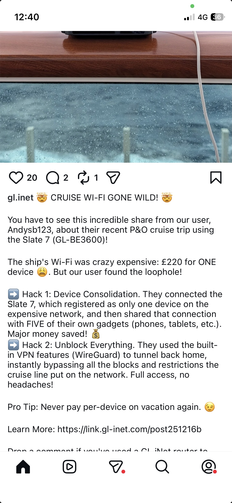

# Other test with VPN and slate 7

Previously in section [setup VPN with flint 3 router](./4-deep-dive-vpn-and-routing.md#setup-vpn-with-flint-3-router), we showed how to configure flint3 to target proton VPN wireguard server.

We are in case  
[`3. Public commercial VPN on home WireGuard router: Laptop → GL.iNet (client, home) WireGuard → Proton VPN server  → Internet`](#reminder-on-nomenclature)

## Wireguard VPN test with slate 7 and flint 3

### Set up a WireGuard server on Flint 3, connected to the ONT at home on Bouygues Telecom Fiber network.

- Connect Mac Mini device to Flint 3's WiFi.
-  Access the Flint 3 WireGuard server configuration page at `http://192.168.8.1/#/wgserver` and generate the server configuration.

### Connect Slate 7 to WireGuard VPN server on flint 3 with iPhone hotspot

- Switch the Mac Mini device's WiFi connection to Slate 7.
- Confirm the iPhone device is not connected to Flint 3's WiFi (connect to Slate 7 to ensure, anyway an iPhone cannot simultaneously consume Wi-Fi and share Wi-Fi (i.e., it cannot take internet from one Wi-Fi network and rebroadcast it to others).
- Check IP address using `https://whatismyipaddress.com/`, from Iphone we have `86.71.230.168` and an IPv6 address `2a02:8440:e505:24ba:dc15:28e2:79a8:c453`.
- This IP is SFR ISP 4G network IP address.
- Repeat on Slate7 iphone 4G hotspot connection:
  - https://docs.gl-inet.com/router/en/4/interface_guide/internet_repeater/ 
  - Also not here we are not using the wan interface but wwan and wwan6
- Check the public IP address on Mac Mini it shows SFR IPv4, e.g., `86.71.230.168`). IPv6 is not detected since not activated in slate 7.
- Visit `https://whatismyipaddress.com/ip/86.71.230.168` to confirm this is the SFR IPv4 address.
- Activate the VPN client at `http://172.16.0.1/#/wgclient` while still connected to Slate 7's WiFi.
- Check the public IP address again (should now show the home WiFi IP (Bouygues ISP), e.g., [`176.143.200.212`](./4-deep-dive-vpn-and-routing.md#lets-observe-the-routing-table-before-vpn-setup-). IPv6 is not detected.
- So we did a vpn to home :)
- Confirm VPN connection routes traffic through the home network.
- Disconnect the VPN and verify the public IP and it reverts to the SFR IPv4 (`86.71.230.168`).

### OpenWRT luci 

Above I used glInet wireguard client and server.
As seen in [section](4-deep-dive-vpn-and-routing.md), OpenWRT router has a plugin to setup a wireguard client.

Actually **`luci-proto-wireguard`** (the LuCI protocol plugin for WireGuard on OpenWrt) supports both **client** and **server** roles.

Here’s how it works:

*   **Client Mode**:  
    You configure the WireGuard interface with a private key and set peers (usually the VPN server) with their public key and endpoint. This is the typical setup for connecting your router to a VPN provider.

*   **Server Mode**:  
    You can also configure your router as a WireGuard server by creating an interface with your private key and adding peers (clients) with their public keys and allowed IP ranges. You’ll need to handle port forwarding if the router is behind NAT.

Essentially, WireGuard itself is peer-to-peer, so the distinction between client and server is mostly about who initiates the connection and who has a public endpoint. LuCI makes both configurations possible.

See
- https://openwrt.org/docs/guide-user/services/vpn/wireguard/client
- https://openwrt.org/docs/guide-user/services/vpn/wireguard/server

Note
- luci-proto-wireguard adds LuCI web UI support for WireGuard.
- When installed via opkg, it automatically pulls in wireguard-tools as a dependency.

<!-- no check more -->

### Use LuCI instead of glInet wiregaurd interface (client)

Follow exact same procedure: https://protonvpn.com/support/openwrt-wireguard?srsltid=AfmBOoo6_PFiI6OyzvkPA9OfJvmYG7feitiYKw0HEhV21vYSIRLlR_rj

See [Proton VPN](./4-deep-dive-vpn-and-routing-media/protonVPN-wireguard.pdf)

Note In firewall setup when creating zone homevpn with `lan => homevpn`, do not forget to tick masquerading so as to
>Enable network address and port translation IPv4 (NAT4 or NAPT4) for outbound traffic on this zone. This is typically enabled on the wan zone

And ensure zone associated to interface 

Not client from glint gui created the zone wgclinet (with not needed forwarding `wgclient => WAN` and always present `lan =>wgclient` rule)

It work when activating the VPN interface from LuCI

When disabling the interface I go back to SFR IP: `IPv4: ? 86.71.230.168`

We are in case  
[`4. Private site\-to\-site (home) VPN: Laptop → GL.iNet (client, holiday location) WireGuard → GL.iNet (server, home) → Internet`](#reminder-on-nomenclature)

When we use mobile phone to connect to wireguard server (directly) same applies, and it leads to same results as if phone is connected to router which hosts the VPN client (could not test phone via router as phone is used for 4G connection here but easily extrapolated by this test [below](#testing-with-slate-7-as-a-repeater-of-flint-3-wifi-where-flint-3-connected-to-fiber-and-where-slate-7-is-running-a-wireguard-client-to-a-proton-vpn-wireguard-server).
What we did [external access section](./../external-access/README.md#method-1use-a-vpn).

It is very close to [VPN.md](./../../appendices/VPN.md#connect-to-vpn-via-phone), why both are in [case 4/4bis](#reminder-on-nomenclature)

I will not do the server with LuCI OpenWRT.

## Comment on IPv6 and repeat mode without VPN 

**IPv6 Native Mode Test (Without VPN)**

1. Enable IPv6 in native mode at `http://172.16.0.1/#/ipv6`.
2. On the router's status page (`http://172.16.0.1/#/internet`), observe:
   - IPv4: `172.20.10.8`
   - IPv6: `2a02:8440:e505:24ba:4af:94ff:fe88:dc96/64`
3. On the laptop, check public IP:
   - IPv4: `86.71.230.168`
   - IPv6: Not detected
4. On the phone (connected directly to the network), check public IP:
   - IPv4: `86.71.230.168`
   - IPv6: `2a02:8440:e505:24ba:dc15:28e2:79a8:c453`
5. This shows IPv6 prefix delegation is active, and IPv4 uses SNAT.

The router applies the same mechanism as seen [in section 3](./3-deep-dive-on-ipv6.md#ipv4ipv6-and-snat)

---
## Testing with Slate 7 as a repeater of Flint 3 WiFi (where flint 3 connected to Fiber), and where slate 7 is running a wireguard client to a proton VPN WireGuard Server

Note in section [Wireguard VPN test with slate 7 and flint 3](#wireguard-vpn-test-with-slate-7-and-flint-3) we did
- Slate 7 as a repeater of **iPhone 4G connection**, and where slate 7 is running a wireguard client to a **home** VPN WireGuard Server running on flint 3

[Here](#testing-with-slate-7-as-a-repeater-of-flint-3-wifi-where-flint-3-connected-to-fiber-and-where-slate-7-is-running-a-wireguard-client-to-a-proton-vpn-wireguard-server) we do
- Slate 7 as **a repeater of Flint 3 WiFi**(where flint 3 connected to Fiber), and where **slate 7 is running a wireguard client to a proton VPN WireGuard Server**

Steps are

1. Duplicate the Flint 3 WiFi setup.
2. Connect to the WireGuard server provided by Proton VPN, following the same steps [as previously described](#use-luci-instead-of-glinet-wiregaurd-interface).
3. Mac Mini connected to Slate 7's WiFi (which is repeating Flint 3's WiFi).
4. Check the public IP address on Mac Mini:
   - IPv4: `212.102.51.97` (Proton VPN server in Tokyo, Japan)
   - IPv6: Not detected
4. IP details:
   - ISP: DataCamp Limited
   - Service: VPN Server
   - Location: Tokyo, Japan

I also connected iphone to slate 7 wifi repeater and checked public IP: We have same results. 

We are still in case  
[`3. Public commercial VPN on home WireGuard router: Laptop → GL.iNet (client, home) WireGuard → Proton VPN server  → Internet`](#reminder-on-nomenclature)

Same for case studied in [section 4](./4-deep-dive-vpn-and-routing.md)

So VPN client also behind a NAT (in case we keep ISP box) would not be an issue.
However VPN server we would have to DNAT/forward or DMZ mode (or bridge) if we plug flint3 behind ISP box (we have the VPN IP in wireguard server conf).
See [appendices](./appendices/appendix-of-change-isp-appendix-double-nat-bridge-and-dmz.md)

## About this post 

Note in section [Wireguard VPN test with slate 7 and flint 3](#wireguard-vpn-test-with-slate-7-and-flint-3) we did
- Slate 7 as a repeater of **iPhone 4G connection**, and where slate 7 is running a wireguard client to a **home** VPN WireGuard Server running on flint 3

This is exactly the same as this cruise case :).

## A crazy case that could work too (but did not manage in practise)

- Slate 7 (repeat iPhone 4G) -> VPN -> home Flint 3 -> Iphone 4g
- home Flint 3 -> VPN -> protonvpn server

I should see proton VPN IP...

Will not dive more this case. (I had kept wgserver in fw)

It would be a [combination of](#reminder-on-nomenclature)
> - 3. Public commercial VPN on home WireGuard router: Laptop → GL.iNet (client, home) WireGuard → Proton VPN server  → Internet
> - 4. Private site\-to\-site (home) VPN: Laptop → GL.iNet (client, holiday location) WireGuard → GL.iNet (server, home) → Internet  

## Proton VPN software 

Instead, we can install the ProtonVPN software directly on the machine (tested and confirmed to work).
However, configuring it on a GL.iNet router offers additional benefits:

*   Multiple devices can connect through a single VPN endpoint, removing the limitation of per-device setup in free version.
*   You can easily choose the VPN server location not allowed via free version

**Note:** In general, using WireGuard on a GL.iNet router also allows you to maintain a VPN connection on laptops where you don’t have full administrative (corp) and can not install the client.

[It would be case 2. Public commercial VPN on laptop: Laptop → ProtonVPN client → Proton VPN server  → Internet  ](#reminder-on-nomenclature)

It could also help to NOT have a VPN on TV stick in particular locked apple TV (fireTV allows it but need a client on the stick, [case 2 in nomenclature](#reminder-on-nomenclature)) 

We also have proton CLI (still case 2) but note

Note the:
- GUI (Free plan) → Auto-connects to the fastest free server, no manual server choice.
- CLI and OpenWRT even with free plan → Lets you pick country and even specific server using commands like

But CLI has still this limitation of connection number

See also [this notes](../../appendices/VPN.md) and protonVPN CLI with qobuz DL: https://github.com/scoulomb/home-assistant/tree/074f96f93a05b7defd4129098ecd1c98639a54bb/sound-video/setup-your-own-media-server-and-music-player

## Comment on Proton Double hop

Proton’s **Double Hop VPN** is a feature offered by Proton VPN that routes your internet traffic through 
**two VPN servers in different countries** instead of just one.

### ✅ **How it works**

*   Normally, a VPN sends your traffic through a single encrypted tunnel to one server.
*   With **Double Hop**, your traffic goes through **two encrypted tunnels**:
    1.  **First server**: Entry point (e.g., in France)
    2.  **Second server**: Exit point (e.g., in Switzerland)
*   The second server is the one that connects to the internet, so websites only see the IP of the second server.

### 🔒 **Benefits**

*   **Extra privacy**: Even if one server were compromised, the second hop adds another layer of protection.
*   **Harder to trace**: Your real IP is hidden behind two layers.
*   **Useful for high-risk activities** (journalists, activists, etc.).

### ⚠️ **Trade-offs**

*   **Slower speeds**: Two hops mean more latency.
*   **Not always needed** for everyday browsing or streaming.

Proton calls this feature **Secure Core** when the first hop is in a privacy-friendly country (like Switzerland or Iceland) 
and the second hop is elsewhere.

## Reminder on nomenclature

[Reminder on nomenclature here](../../../notes-temp/Links-mig-auto-cloud/2025-consolidation/Dojos/VPN-Dojo/VPN-dojo.md)

> - 1. Corporate VPN on laptop : Laptop → Corporate VPN client → Corporate VPN server → Internet  
> - 2. Public commercial VPN on laptop: Laptop → ProtonVPN client → Proton VPN server  → Internet  
> - 3. Public commercial VPN on home WireGuard router: Laptop → GL.iNet (client, home) WireGuard → Proton VPN server  → Internet
> - 4. Private site\-to\-site (home) VPN: Laptop → GL.iNet (client, holiday location) WireGuard → GL.iNet (server, home) → Internet  
> - 5. Double VPN: Corporate VPN inside private home WireGuard path (or ordering variant).  

If we use on top of case 3,4 a VPN on laptop 1 (corporate),2 (not tested) we enter in case 5.
And even triple VPN if we consider [case 5](#a-crazy-case-that-could-work-too-but-did-not-manage-in-practise) <!-- not details more triple -->

I would add case 4 bis when we do it via a [VPN server at home](../../appendices/VPN-tailscale.md#qnap-vpn-still-requires-to-nat-vpn-port-and-not-all-ports) 
and [tailscale](../../appendices/VPN-tailscale.md#tailscale-is-an-alternative-vpn-to-access-local-network-it-completes).

[Proton VPN with cli or gui](../../appendices/VPN-tailscale.md#example-of-vpn-not-related-to-local-access-and-free) is [config 2](#proton-vpn-software-) 
and best is to be in [case 3 seen above](#testing-with-slate-7-as-a-repeater-of-flint-3-wifi-where-flint-3-connected-to-fiber-and-where-slate-7-is-running-a-wireguard-client-to-a-proton-vpn-wireguard-server)/[case 3/seen in section 4](4-deep-dive-vpn-and-routing.md)

Therefore [Qobuz DL  script could be simplified to handle VPN on router](./../../sound-video/qobuz-dl/qobuz-dl.sh)

## Comment on VPN IP

Note VPN could help to have a fix static IPv4 if we pay for this option, if ISP offer only a dynamic IPv4.

[See more details](../../../notes-temp/Links-mig-auto-cloud/2025-consolidation/Dojos/VPN-Dojo/VPN-dojo.md).
<!-- VPN snat fix ip -->  emy -->is actually vpn provider one -->, 

IPv6 is most likely always static though.

## When sharing phone connection aboard avoid charges by using following tip

On an iPhone, you can avoid **cellular data roaming** and control **network selection** easily through Settings. Here’s how:

***

### ✅ **Disable Cellular Data Roaming**

1.  Open **Settings** → **Cellular** (or **Mobile Data**).
2.  Tap **Cellular Data Options**.
3.  Tap **Data Roaming** and **turn it OFF**.
    *   This prevents your phone from using data when you’re on a foreign network.

***

### ✅ **Disable Voice Roaming (Optional)**

*   In the same menu, you can also turn off **Voice Roaming** if available, to avoid calls on other networks.

***

### ✅ **Manual Network Selection**

1.  Go to **Settings** → **Cellular** → **Network Selection**.
2.  Turn **Automatic** OFF.
3.  Choose your home carrier manually.
    *   This prevents the phone from switching to a roaming partner network.

***

### ✅ **Extra Tips**

*   If you want **zero roaming**, you can also **disable Cellular Data completely**:
    **Settings** → **Cellular** → toggle **Cellular Data OFF**.
*   For trips abroad, consider enabling **Airplane Mode** and using **Wi-Fi only**.

(why 4g may not work in Monaco)

## Note on LAN settings

When we replicate Flint 3 wifi [here](#testing-with-slate-7-as-a-repeater-of-flint-3-wifi-where-flint-3-connected-to-fiber-and-where-slate-7-is-running-a-wireguard-client-to-a-proton-vpn-wireguard-server).

**We encountered a LAN conflict because both routers were using the same IP settings:**

*   **IP Address:** `192.168.8.1`
*   **Subnet Mask:** `255.255.255.0`
*   **Default DHCP Range:** `192.168.8.100 – 192.168.8.249`

To resolve this, I changed the **Slate 7** router configuration to:

*   **IP Address:** `172.16.0.1`
*   **Subnet Mask:** `255.255.255.0`
*   **Default DHCP Range:** `172.16.0.100 – 172.16.0.249`

If I increase the subnet mask, the DHCP range remains the same by default.  
However, with a **255.255.255.0** mask, the maximum usable IP in this subnet is `172.16.0.254` (not `172.16.255.254`, which would require a /16 so (`255.255.0.0`)mask).

See http://172.16.0.1/#/lanip

## Note on first time setup

On flint3 I used the first time the password printed on the router via https://docs.gl-inet.com/router/en/4/user_guide/gl-be9300/
<!-- and mac kept it --> and then setup a new wifi. On slate 7 we have the screen. <!-- stop here -->

## Note on Apple TV and netflix

On **Apple TV**, you **cannot install a VPN client app directly** because tvOS does not support VPN apps like iOS does. However, you can still use a VPN with Apple TV through these methods:

### Options to use VPN on Apple TV:

1.  **VPN on your router**
    *   Configure WireGuard or OpenVPN on your home router (or GL.iNet router like Flint 3 / Slate 7).
    *   All devices connected to that router, including Apple TV, will use the VPN.

2.  **Smart DNS from your VPN provider**
    *   Many VPN services (e.g., ProtonVPN, NordVPN) offer Smart DNS.
    *   You set the DNS on Apple TV (Settings → Network → Wi-Fi → Configure DNS → Manual).
    *   This works for geo-unblocking but does **not encrypt traffic**.

3.  **VPN via Ethernet sharing (Mac/PC)**
    *   Share a VPN connection from your Mac or PC to Apple TV via Ethernet or Wi-Fi.
    *   Requires enabling Internet Sharing on macOS or Windows.

### Netflix

Netflix put restriction on home SNAT IP (home restriction).

##### 1.  **VPN on your router**

[Configuration 4](#reminder-on-nomenclature) is the perfect usage for removing this restriction with Netflix .

In particular, see comment [above](#proton-vpn-software-)
> It could also help to NOT have a VPN on TV stick in particular locked apple TV (fireTV/SFR TV allows it but need a client on the stick, [case 2 in nomenclature](#reminder-on-nomenclature)) 

We could also use a public VPN (configuration 3) but Netflix will probably block known VPN IPs.

However this setup is good if want access content from other country/and not being tack.

Note the usage with Kodi (SFR TV, fireTV, chinese box....but not appleTV), this avoids VPN setup there.
(will not test<!--optional and no plan to document more -->))

<!-- also will not explore routing option to only route through VPN traffic from given device only,
or based on target on the VPN server: http://192.168.8.1/#/wgserver / route rules tab (already mentioned will not do, osef where) -->

We had done same equivalent setup without router here: [appendices/VPN.md](../../appendices/VPN.md#laptop-hotspot--phone-usb-with-4g)

##### 2.  **Smart DNS from your VPN provider**

- Smart DNS only changes the DNS resolution for certain domains (e.g., streaming services) so they resolve to IPs that bypass geo-blocking.
- It does not tunnel traffic or alter the source IP of your packets. Your ISP and the destination server still see your real public IP.

If we want to change your SNAT IP, you need a VPN (WireGuard/OpenVPN) or a proxy because those actually route traffic through another endpoint.

So could get content from other location but does not bypass home restriction.

Note I cloud private [relay](4-deep-dive-vpn-and-routing.md#vpn-on-machine-and-vpn-on-router-combination-double-vpn) enters in proxy category.

##### 3.  **VPN via Ethernet sharing (Mac/PC)**

We had done it here : [appendices/VPN.md](../../appendices/VPN.md#laptop-hotspot--phone-usb-with-4g)

## Note on repeater and other options

On a GL.iNet router, the options you see under **Internet** (like *Ethernet 1/2*, *Repeater*, *Tethering*, and *Cellular*) represent different WAN connection methods. Here’s what each means:

See As described in [section 6](./6-router-mode.md#part-1-internet-connection-options-how-router-gets-internet) 

### **1. Ethernet 1 / Ethernet 2**

*   These are the **wired WAN ports** on the router.
*   You can connect the router to your modem or another network using an Ethernet cable.
*   **Ethernet 1 vs Ethernet 2**:
    *   Some GL.iNet models have multiple Ethernet ports that can be configured as WAN or LAN.
    *   Usually, **Ethernet 1** is the default WAN port, and **Ethernet 2** can be used as LAN or secondary WAN (for failover or load balancing).

***

### **2. Repeater**

*   This mode connects the router to an **existing Wi-Fi network** and shares that connection.
*   The router acts as a **Wi-Fi extender** or **bridge**, useful when you don’t have wired access.
*   Example: You’re in a hotel with Wi-Fi only → use Repeater to connect and then share via your own secure SSID.

***

### **3. Tethering**

*   This uses a **USB connection to a smartphone** for internet.
*   Your phone acts as a modem, and the router uses its data connection.
*   Common when traveling or when you want to share mobile data without using Wi-Fi hotspot mode.
*   Requires enabling **USB tethering** on your phone.

***

### **4. Cellular**

*   This uses a **4G/5G USB modem or built-in module** (on some models) to connect directly to mobile networks.
*   Ideal for remote areas or backup internet.
*   Needs a SIM card and proper APN configuration.

***

✅ **Key Differences**:

*   **Ethernet** = Wired, stable, fastest.
*   **Repeater** = Wireless bridge, depends on existing Wi-Fi quality.
*   **Tethering** = Via phone USB, uses phone’s data plan. (could not make it work, my wire is charge only)
*   **Cellular** = Direct mobile network via modem/SIM. (simPoYo)

<!-- optional to explore those option and can extrapolate -->

See http://192.168.8.1/#/internet and [failover](2-Flint3-router-setup-BYTEL.md#failover)

[Cruise example](#a-crazy-case-that-could-work-too-but-did-not-manage-in-practise), I expect to replicate boat WiFi but tethering would work.
<!-- do not read deep article -->

## Repeater mode vs mesh vs same SSID

See [section 6](./6-router-mode.md#extender-mode)

### **1. Mesh Mode**

*   **What it is:** A true mesh network where multiple nodes (routers) work together as one unified system.
*   **Key features:**
    *   Automatic routing and self-healing (if one node fails, traffic reroutes).
    *   Seamless roaming: devices switch between nodes without dropping connection.
    *   Centralized management.
*   **Use case:** Large homes or offices needing consistent coverage and smooth handoff.

See https://docs.gl-inet.com/router/en/3/setup/gl-b1300/mesh/
***

### **2. Repeater Mode**

*   **What it is:** A single device extends the range of an existing Wi-Fi by rebroadcasting the signal.
*   **Key features:**
    *   Creates a second hop, which can reduce speed (due to retransmission).
    *   No smart routing; it just repeats the main router’s signal.
*   **Use case:** Boost coverage in dead zones without adding Ethernet backhaul.

***

### **3. Same SSID on Different Routers**

*   **What it is:** Two or more routers configured with the same network name (SSID) and password.
*   **Key features:**
    *   Devices can connect to either router, but roaming is **not seamless** unless you enable 802.11r/k/v (fast roaming).
    *   Each router acts independently; no dynamic path optimization.
*   **Use case:** Simple way to mimic roaming without mesh hardware, but can cause sticky client issues (device stays on weak signal).

***

What I did when configuring also 2G, 5G and 6G with same SSID <!-- ideal here is same MLO --> or if changing router (same ssid/pwd to not reconfigure all devices).

Note: when disabled 2g network lost avr, fixed it by disconnecting for a while and plug again, similar to [samsung db d 8500](../../sound-video/bd-d8500-setup.md)

For HEOS to not connect to 2G network I configured same SSID `scoulomb` for 5G and 6G network.
And call 2.4G network `scoulomb-legacy-iot`, this enabled to play blue-ryay plug to AVR in multiroom without lag.
See link between WiFi version and bands at [section 2](./2-Flint3-router-setup-BYTEL.md#summary-of-wifi-80211-standard-wi-fi-wifi-6e7-name-and-band-that-can-be-used)

If AVR lost network unplug it 5min.(confirmed twice)

✅ **Summary Table**

| Mode          | Seamless Roaming       | Smart Routing | Speed Impact | Setup Complexity |
| ------------- | ---------------------- | ------------- | ------------ | ---------------- |
| **Mesh**      | ✔ Yes                  | ✔ Yes         | Minimal      | Medium           |
| **Repeater**  | ✖ No                   | ✖ No          | High         | Low              |
| **Same SSID** | Partial (with 802.11r) | ✖ No          | Minimal      | Low              |

<!--
Will not explore
- routing option on wiregusrd server
-->

## Set back access to Jellyfin 

- [via Proxy](../external-access/README.md#method-3-use-ha-proxy-) -> https://jellyfin.coulombel.net (working without vpn and not home network)
- [via Wiregaurd](../external-access/README.md#method-1use-a-vpn) (they recommend DDNS for VPN endpoint but not added in generated conf) then when connected remind, you can not use mDNS
  - so do http://192.168.8.102:8096 (can use static IP for convenience) - this works with vpn connection and not on home network
  - Be careful when modifying firewall rules above, ensure in Luci we allow `wgserver (glinet interface) => lan`
  - However I lost access to router page, if an issue reset and and all conf via [glInet](#use-luci-instead-of-glinet-wiregaurd-interface-client)
<!-- OK -->

## Concluded 

<-- all above ccl and this doc is concluded OK DONE CCL -->
<!-- 30dec25: all flint3 router and external access ccl DONE, reccl post xmas OK DONE CONFIRMED (as was ccl before xmas)-->
<!-- 31dec25: addition reconfirmed previous conclusion all flint3 router and external access ccl DONE -- All ccl done -->
<!-- link tailscale and VPN.md done, HA repo on dell does not have more inputs -->
<!-- qobuzDL details done -->

<!-- Slate 7 to Ethernet on flint 3 not tested OK -->

<!-----why not----------->

<!-- 2 dec 25 update all OK and re-ccl -->

<!-- branchement router, hifi (see bd-d8500-setup.md) independent and will be done as planned so OK and part of rangement so even not tracked in todo-->
<!-- same for frais resiliation et activation btel  --> 
<!-- comet indepdendent even if tailscale etc, and no document -->
<!-- kodi to not document and do not do it now, [bd-d8500-setup.md](..%2F..%2Fsound-video%2Fbd-d8500-setup.md) stop there, link wiring no -->

<!-- so all concluded done CONFIRMED OK - STAMPED  and RESTAMPED OK DONE and restamped 2jan26 OK DONE STAMPED and restamped OK-->

