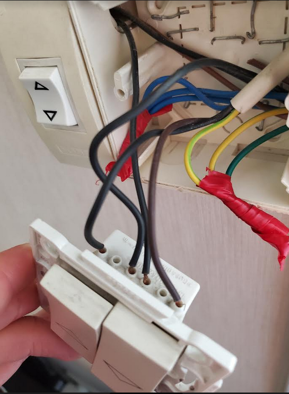
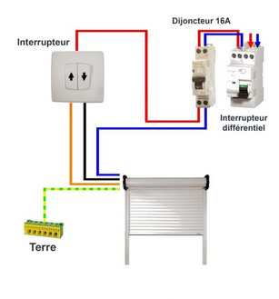
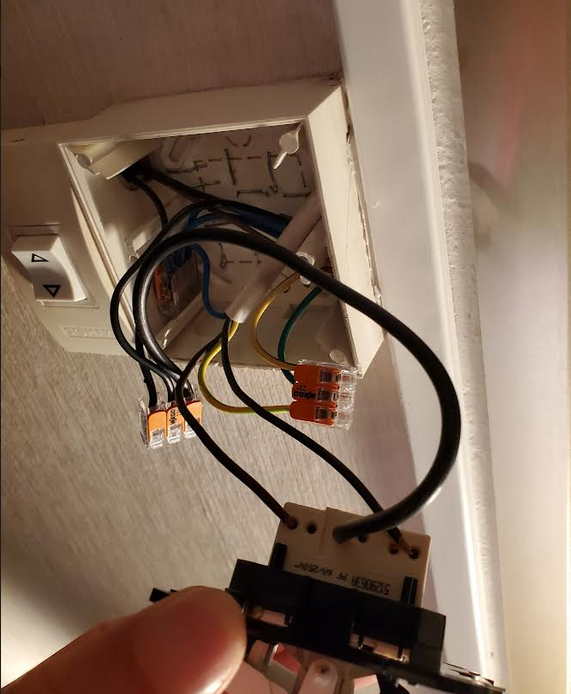
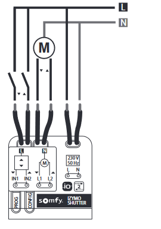
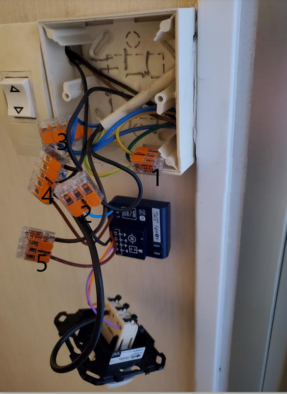

# Tahoma integration 

## Volet Hardware setup 

#### Volet chambre 

Use built-in Somfy-IO

#### Volet salon 

Use Izymo IO: https://www.automatismes.net/recepteurs-domotique/5140-somfy-1822660-micro-recepteur-izymo-io-comptabible-volets-roulants.html

##### We had thid initial setup

- Vert 
    - Vert fonce: terre installation 
    - Vert/Jaune qui sort de la gaine: Terre volet rolant
    - Vert/Jaune restant: Terre du store

- Bleu
    - Bleu: terre installation 
    - Bleu qui sort de la gaine: neutre volet rolant
    - Bleu: Terre du store

- Au niveau interrupteur volet de droite a gauche
    - pin1: descente
    - pin3: cable de phase
    - pin4: repiquage de la phase (pour le store)
    - pin6: montee

- Au niveau du trou partant vers l'interrupteur du store on observe ensuite 3 fils qui sont 
    - Marron: descente
    - Noir: montee
    - Noir partant de l'interrupteru phase

##### Standard

Nous sommes donc dans le cas standard, une fois pour le volet et pour le store

On observe que c'est 4 cable car on tourne on a un

, avec moteur neutre vers neutre installation et moteur Terre vers Terre installation. Mais Izymo a besoin de repiquer un neutre en plus.

- L (phase)
    - Phase intallation -> interrupteur
    - Interrupteur vers moteur L1 montee,
    - Interrupteur moteur L2 descente, (cable en plus cr montee descente)
- N (Neutre)  moteur -> neutre installation
- T (terre) moteur -> terre installation

On peut donc avoir une installation equivalente (sans le repiquage de phase au niveau de l'interrupteur)

J'ai utilise un interrupteur somfy inis: https://www.amazon.fr/Somfy-1870881-Commande-Interrupteur-Descente/dp/B095CVJCJ1/ref=sr_1_4?keywords=interrupteur+volet+roulant&qid=1691931810&refinements=p_4%3ASomfy&s=hi&sr=1-4

On notera le `wago` le plus a gauche, qui a prend la phase de l'installation et renvoit vert l'interrupteur
- Store
- Et volet (cable noir epais)

(Montage en derivation)

##### Nous sommes maintenant donc pret a installer le module `Izymo`.

Utliliser la video et le cablage ici 

https://www.automatismes.net/recepteurs-domotique/5140-somfy-1822660-micro-recepteur-izymo-io-comptabible-volets-roulants.html

La notice est aussi dispo: https://www.servistores.com/repository/documents/plans/Notice-recepteur-izymo_volet-roulant_io.pdf ou dans ce [repo](./media/Notice-recepteur-izymo_volet-roulant_io.pdf).

Le motage concret est donc le suivant

- wago1 - La terre est inchange (terre installation, volet, store) 
- wago2 - Connecte montee moteur volet au Izymo (L1)
- wago5 - Connecte descente moteur volet au Izymo (L2)
- wago3 - Connecte neutre
    - Neutre installation 
    - Neutre moteur store 
    - Neutre moteur volet
    - Neutre Izymo (N)
- wago 4 - connecte phase 
    - Phase installation 
    - Phase interrupteur store
    - **Phase interrupteur volet** (2 fils sur le schema mais un seul phisiquement sur le montage concret)
    - Phase Izymo (L)
- **Enfin (A) et (B) Izymo connecte a montee et descente interrupteur**

On voit donc que ce montage concret est coherent avec le schema de montage.

En gras nous avons mis les connexions non necessaire si utilise pas interrupteur filaire

On voit donc dans ce cas que le Izymo (voir schema montage Izymo au dessus) prend les meme inputs qu'cas [standard normal](#standard) (L, montee moteur L1, descente moteur L2) mais a besoin de repiquer le neutre.

Quand interrupteur filaire: montee moteur L1, descente moteur L2 recupere sur Izymo A/B et interupteur connecte sur phase installation (wago). Equivalent donc interrupteur volet [standard](#standard).

Pour gagner espace boitier 
- utiliser wago 2 entree au loeu de 3 entree 
- fil plus fin
- interrupteur plus fin 

## Softare setup 

### Pair

Pair with Tahoma box:
- Izymo module, volet
- Eventually Philips hue 