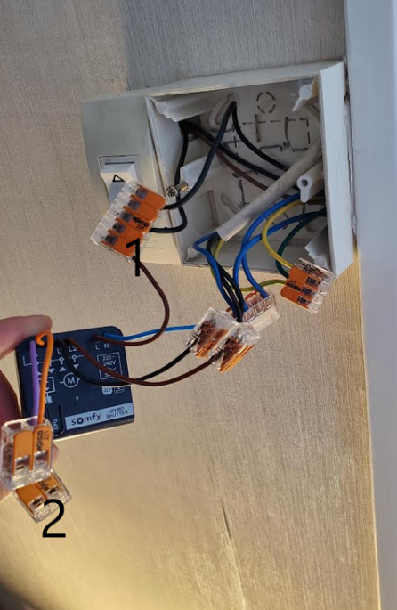

# Tahoma integration 

## Volet Hardware setup 

#### Volet chambre 

Use built-in Somfy-IO

#### Volet salon 

Use Izymo IO: https://www.automatismes.net/recepteurs-domotique/5140-somfy-1822660-micro-recepteur-izymo-io-comptabible-volets-roulants.html

##### We had thid initial setup

- Vert 
    - Vert fonce: terre installation 
    - Vert/Jaune qui sort de la gaine: Terre volet rolant
    - Vert/Jaune restant: Terre du store

- Bleu
    - Bleu: terre installation 
    - Bleu qui sort de la gaine: neutre volet rolant
    - Bleu: Terre du store

- Au niveau interrupteur volet de droite a gauche
    - pin1: descente
    - pin3: cable de phase
    - pin4: repiquage de la phase (pour le store)
    - pin6: montee

- Au niveau du trou partant vers l'interrupteur du store on observe ensuite 3 fils qui sont 
    - Marron: descente
    - Noir: montee
    - Noir partant de l'interrupteru phase

##### Standard

Nous sommes donc dans le cas standard, applique 2 fois
- pour le volet
- et pour le store

On observe que c'est 4 cable (car gestion montee et descente, comme si on avait [2 retour lampe](./media/schema-elec-simple-allumage.PNG) : https://www.123elec.com/branchement-interrupteur-va-et-vient)

- L (phase)
    - Phase installation -> (vers) interrupteur
    - Interrupteur -> moteur L1 montee,
    - Interrupteur -> moteur L2 descente (cable en plus car montee descente)
- N (Neutre)  moteur -> neutre installation
- T (terre) moteur -> terre installation

On peut donc avoir une installation equivalente (sans le repiquage de phase au niveau de l'interrupteur)

J'ai utilise un interrupteur Somfy Inis: https://www.amazon.fr/Somfy-1870881-Commande-Interrupteur-Descente/dp/B095CVJCJ1/ref=sr_1_4?keywords=interrupteur+volet+roulant&qid=1691931810&refinements=p_4%3ASomfy&s=hi&sr=1-4 (ancien interrupteur avait une mise en place des fil compliquee "en force").

On notera le `wago` le plus a gauche, prends la phase de l'installation et renvoit vert l'interrupteur
- Store
- Et volet (cable noir epais)

(Montage en derivation)

##### Nous sommes maintenant donc pret a installer le module `Izymo`.

Utliliser la video et le cablage ici 

https://www.automatismes.net/recepteurs-domotique/5140-somfy-1822660-micro-recepteur-izymo-io-comptabible-volets-roulants.html

La notice est aussi dispo: https://www.servistores.com/repository/documents/plans/Notice-recepteur-izymo_volet-roulant_io.pdf ou dans ce [repo](./media/Notice-recepteur-izymo_volet-roulant_io.pdf).

Le motage concret est donc le suivant

- wago numero 1 - La terre est inchange 
    - terre: installation
    - terre store
    - terre volet 
- wago numero 2 - Connecte montee moteur volet au Izymo (L1) - fil noir
- wago numero 5 - Connecte descente moteur volet au Izymo (L2) - fil marron
- wago numero 3 - Connecte neutre
    - Neutre installation 
    - Neutre moteur store 
    - Neutre moteur volet
    - Neutre Izymo (N)
- wago numero 4 - connecte phase 
    - Phase installation 
    - Phase interrupteur store
    - **Phase interrupteur volet** (2 fils sur le schema mais un seul phisiquement sur le montage concret)
    - Phase Izymo (L)
- **Enfin (A) et (B) Izymo connecte a montee et descente interrupteur**

On voit donc que ce montage concret est coherent avec le schema de montage.

En gras nous avons mis les connexions non necessaire si utilise pas interrupteur filaire.

On voit donc dans ce cas que le Izymo (voir schema montage Izymo au dessus) prend les meme inputs qu'un cas [standard normal](#standard) (L, montee moteur L1, descente moteur L2) mais a besoin de repiquer le neutre en plus.

Quand interrupteur filaire: montee moteur L1, descente moteur L2 recupere sur Izymo A/B et interupteur connecte sur phase installation (wago). Equivalent donc interrupteur volet [standard](#standard).

Pour gagner espace boitier 
- Utiliser wago 2 entree au lieu de 3 entree (wago 2 et 5 sur la photo). Un wago 4 entre n'existe pas.
- Fil phase plus fin <!-- pris une gaine 4 cables souple, 4G1.5mm2, 2300w, H05 VV-F, cable amzazon trop epais et pas prendre cable non souple -->
- Interrupteur plus fin : https://www.somfypro.fr/produits/-/e-cat/1811272/COMMANDE_GENERALE_SMOOVE_ORIGIN_IB (petit defaut sur cette interrupteur on doit rester appuyer (test sans cavalier et toute positions))
- On en profitera pour ordnonner cable installation puis store puis volet puis Izymo dans les wago

Et malheureusement ca ne rentre pas dans le boitier :(.
Donc  pas d'interrupteur manuel :(
- on enleve le cable de phase du wago 5 entree vers l'interrupteur (1)
- et on met un wago sur A/B pour isoler (2)
Je garde le wago 5 entree de la phase vers interrupteur et l'interrupteur avec le fil fin en cas de probleme (plus de pile, micro recpteur casse...)

On range tout 

   

et on met un bouton automatique IO (avec une pile pffff...)

Pour association, interrupteur volet check [this note](./hardware-remotes/README.md)

<!-- ok clear re-cf YES OK STOP - plus espace optional de decrire ici OK-->

Le store de la chambbre etant nativement automatique la phase installation est directemment connecte au moteur (fil L1).
D'ou un wago pour isoler l'ancienne descente (L2).
Et cette phase repart sur le store (qui lui a L1 et L2 car [interrupteur](#standard))

<!-- no need to re-check - could unplug to double check but ok stop -- yes ok-->

## Software setup 

### Pair

Pair with Tahoma box:
- Izymo module, volet
- Eventually Philips hue 

### Network 

See note [on network](../README.md#note-on-network)

<!-- stop checking more -->

### Alexa integration and routines 

Tested OK.
Can use routine. 

### Use apple homekit integration

Working well for "volet natif" but not with Izymo ==> Izymo module is not recognized as HomeKit device.

See https://forum.somfy.fr/questions/2528440-compatibilite-homekit-module-izymo

### Use OverKiz API and HA integration

I had an issue as OverKiz stop working, could believe it was a [network issue](#network),

But from https://github.com/home-assistant/core/issues/93511, this is due to an issue in HA.
Need to use last version (take image from DockerHub not recommend QNAP one).

This is the same problem reported here: https://community.home-assistant.io/t/overkiz-by-somfy-integration-failed-to-connect-how-to-debug/438011.

So I redeploy the docker image with last version as explained here https://www.home-assistant.io/installation/alternative.
See also [README](../README.md#installing-home-assistant-ha-on-qnap-nas).

It worked succesfully.
For store chambre we both have overkiz and HomeKit integration.

In dashbaord we can create (it is cover entity)
- a view with all the cover 
- Edit living room and bedroom view to add respective cover with overkiz (remove homekit one, the one without stop button)

See capture:

Thus we could use OverKiz API directly (via Python client) used by HA: https://github.com/iMicknl/python-overkiz-api/

### Tahoma local integration

We have to use OverKiz API which is not local.
They are thinking to integrate it in the Python client instead of using OverKiz cloud API: https://github.com/home-assistant/core/issues/69558

We can play with this local API anyway and call it from HA.
See [Local Tahoma](./local-tahoma/local-tahoma.md).

<!-- done above completed except montage final DONE 31 aug23- could integrate shell cmd in HA 
optional OK and add in global todo-->

## No tahoma integration (esphome based)

We could use [ESPHome](../espHome/README.md).

## Next ideas

- https://www.la-maison-electrique.com/somfy/62578-lanceur-de-scenario-tahoma-1824035-3660849517052.html
    - See [Hardware remotes](./hardware-remotes/README.md)
- Izymo on-off mais va etre complique car on la phase et retour lampe sur l'interrupteur (comme L -> L1/L2 moteur) mais neutre pas accessible facilement dans mon installation :(: https://www.somfy.fr/produits/1822649/recepteur-on-off-io-izymo (see montage eventuel) <!--if done later and link not done ok -->

<!-- ok ccl Fully 31 aug23, and remaining item independent move to gobal todo in top readme -->

## Cout estime

### Cout total 

~ 170 euros

##### Cout reel 

- Micro recepteur -  75 euros (Automatimse.net)
- Wago - 20 euros (Mr Birco (3,5) + AMZ (2 bornes) )
- Commande  Smoove Orgin RS100 IO - 30 euros (ebay)
- Commande Situo optional - 30 euros (ebay)
- Box Tahoma (deja acquise) 

#### Cout qui aurait pu etre evite

- Erreur cable trop epais - 15 euros (A<Z>)
- Bout de gaine 4 files file (<1 euros) (Mr Brico)
- Interrupteur Manuel SOmfy Smoove Origin IB - 30 euros (stock pro) - Bien d'avoir un interrupteur manuel (mais le Inis aurait suffir)

### Cout evite, article retourne

- Wago cable non souple (Mr Brico)
- Ecrou pour ecarter interrupteur (Mr Brico)
- Pince a denuder - 20 euros (AMZ)
- Interrupteur Inis retournee +schneider - 15 + 20 euros (AMZ)
- Boitier smoove (interruteur manuel, celui fourni avec automatique compatible) - 5 euros (AMZ)