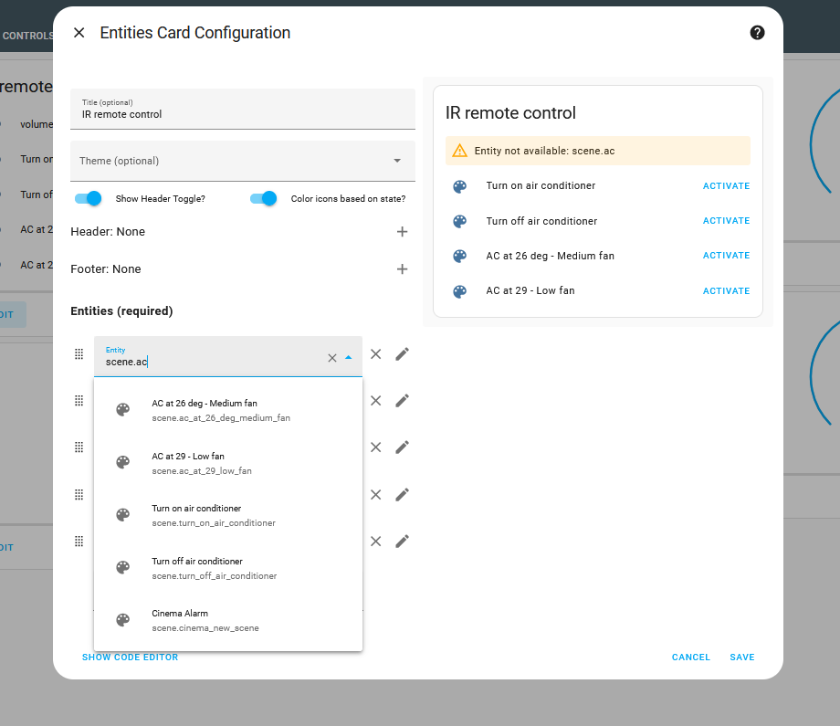

# Tuya integration 


## Setup Tuya 

- Install Android app, and pair IR dongle using bluetooth 
- Add devices Daikin, Denon IR remote from the Dongle
- Then follow this procedure carefully: https://www.home-assistant.io/integrations/tuya/


### Traps

- Use last version of HomeAssistant (last stable **DockerHub** image). Same issue as with [OverKiz](../Tahoma/tahoma-integration.md#use-overkiz-api-and-ha-integration). (was tuck here for a year with tuya issue in HA....)
- Do not use SmartHome APK it is very bad and prevents from using Tuya Android Store app
    - So do not do  [add smart devices from Tuya console, scan qr code from Tuya app to download SmartHome APK, and scan this same QR to login to project after SmartApp download]
    - It is painful and on top of it Tuya HA will not see the devices 
- Use Tuya App only 
    - In Tuya `LINK DEVICES BY APP ACCOUNT`, and scan QR code from Tuya app
    - And add your devices only from Tuya App and check they are present in Tuya console
    - Use Access Id/Access secret from project and  u/p are the one from Tuya account when adding Hub in HA
    - Project SAAS is not required (note it was usable in SamrtHome apk instead of Tuya u/p)


The device are recognized by home assistan

## Tap actions

However no entities as my device are not supported in HA

````
Smart IR
Tuya
Smart IR (unsupported)
````

We have to configure Tap actions in Tuya App


Then we can integrate this in HA in Dashbaord and Automation




## Control Tuya devices via API

See [Tuya API](./tuya-api.md)


## Other ideas

As in Somfy we can use [EspHome](./../Tahoma/tahoma-integration.md#next-ideas)

See https://oliverfalvai.com/notes/posts/how-to-make-infrared-devices-smarter-using-esphome/ (use Arduino Esp32?). Maybe start with SmartButto.

We can see in Wifi list that IR remote I bougth is based on ESP32, why not flash it get ride of it Tuya ;): ttps://tasmota.github.io/docs/Tuya-Convert/