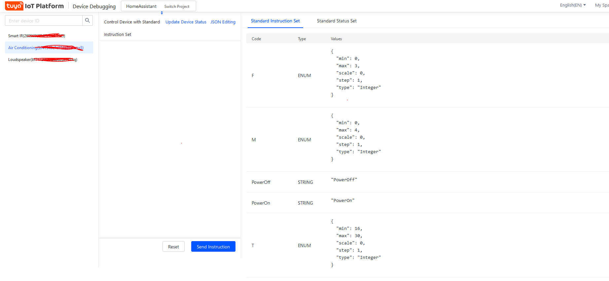

# Tuya API

 https://gist.github.com/scoulomb/8381cac25d5f695a5edf734e7ae47d6e 


How to control air conditionner via Tuya API

## Get device IDs

In `Tuya dev console > devices > get ids`

````
Device Name	Device ID	Product	Source	Online Status	Device Type	Activation Time	Device Permission	Operation
Smart IR	2........5	RM mini	sylvaincoulombel@gmail.com	Online	Real Device	2023-08-14 14:26:46	Read, write, and Manage	Debug Device
Air Conditioning	b........5	红外空调	s......l@gmail.com	Online	Real Device	2023-08-14 14:26:46	Read, write, and Manage	Debug Device
Loudspeaker	b........q	功放	s......l@gmail.com	Online	Real Device	2023-08-14 14:26:46	Read, write, and Manage	Debug Device
````

````
export IR_ID=2605606084f3ebe93d45
export AC_ID=bf41343e7d214c5cc5ovs5
````

## Use API explorer

Then API explorer: https://eu.iot.tuya.com/cloud/explorer, select IR common API and ensure good project is selected.

We will copy generated curl command

````
I will use local laptop (for certificate issue): ssh s....b@192.168.86.70
Note I will use google home local IP, as double NAT issue: https://serverfault.com/questions/404516/ssh-not-working-through-double-nat
Configured in port management of SFR (22 -> 2222) and ghome (2222 -> 22). May need to use SFR wifi here
See [README](../README.md#note-on-network). 
````


### Get remotes list

````json
$ curl  --request GET "https://openapi.tuyaeu.com/v2.0/infrareds/2605606084f3ebe93d45/remotes" --header "sign_method: HMAC-SHA256" --header "client_id: f7act8hhaam4fca5qdt5" --header "t: 1692104585787" --header "mode: cors" --header "Content-Type: application/json" --header "sign: 1D280CD2AF25E52D295C964640CE4E0B4DD8264E41A6CC50FEE5FB3B352B76FB" --header "access_token: 8b36085c757830381dfee35d303a013a"  | jq 
  % Total    % Received % Xferd  Average Speed   Time    Time     Time  Current
                                 Dload  Upload   Total   Spent    Left  Speed
100   427  100   427    0     0   1109      0 --:--:-- --:--:-- --:--:--  1106
{
  "result": [
    {
      "area_id": 0,
      "brand_id": 907,
      "brand_name": "Denon",
      "category_id": 7,
      "operator_id": 0,
      "remote_id": "bf7472fbc8d8b82de2cckq",
      "remote_index": 8932,
      "remote_name": "Loudspeaker"
    },
    {
      "area_id": 0,
      "brand_id": 187,
      "brand_name": "DaiKin",
      "category_id": 5,
      "operator_id": 0,
      "remote_id": "bf41343e7d214c5cc5ovs5",
      "remote_index": 10502,
      "remote_name": "Air Conditioning"
    }
  ],
  "success": true,
  "t": 1692104598779,
  "tid": "1aca66fa3b6c11eea9649a766792eea9"
}
````

We can see device ids are consistent

### Get keys or RC

Use IR ID + Daikin AC remote ID

`````json
$ curl --request GET "https://openapi.tuyaeu.com/v2.0/infrareds/2605606084f3ebe93d45/remotes/bf41343e7d214c5cc5ovs5/keys" --header "sign_method: HMAC-SHA256" --header "client_id: f7act8hhaam4fca5qdt5" --header "t: 1692104806818" --header "mode: cors" --header "Content-Type: application/json" --header "sign: E83968279CC6290D44614A7E917252975E0A3B48BEB5C2BC089C0E8CCE50E3F7" --header "access_token: 8b36085c757830381dfee35d303a013a"  | jq
  % Total    % Received % Xferd  Average Speed   Time    Time     Time  Current
                                 Dload  Upload   Total   Spent    Left  Speed
100  8439    0  8439    0     0  16386      0 --:--:-- --:--:-- --:--:-- 16354
{
  "result": {
    "brand_id": 187,
    "category_id": 5,
    "duplicate_power": false,
    "key_list": [
      {
        "key": "F",
        "key_id": 0,
        "key_name": "fan speed",
        "standard_key": true
      },
      {
        "key": "M",
        "key_id": 0,
        "key_name": "mode",
        "standard_key": true
      },
      {
        "key": "PowerOff",
        "key_id": 0,
        "key_name": "power off",
        "standard_key": true
      },
      {
        "key": "PowerOn",
        "key_id": 0,
        "key_name": "power on",
        "standard_key": true
      },
      {
        "key": "T",
        "key_id": 0,
        "key_name": "temperature",
        "standard_key": true
      }
    ],
    "key_range": [
      {
        "mode": 0,
        "mode_name": "mode cool",
        "temp_list": [
          {
            "fan_list": [
              {
                "fan": 2,
                "fan_name": "speed middle"
              },
              {
                "fan": 0,
                "fan_name": "speed auto"
              },
              {
                "fan": 1,
                "fan_name": "speed low"
              },
              {
                "fan": 3,
                "fan_name": "speed high"
              }
            ],
            "temp": 18,
            "temp_name": "temperture 18"
          },
          {
            "fan_list": [
              {
                "fan": 2,
                "fan_name": "speed middle"
              },
              {
                "fan": 0,
                "fan_name": "speed auto"
              },
              {
                "fan": 1,
                "fan_name": "speed low"
              },
              {
                "fan": 3,
                "fan_name": "speed high"
              }
            ],
            "temp": 19,
            "temp_name": "temperture 19"
          },
          {
            "fan_list": [
              {
                "fan": 2,
                "fan_name": "speed middle"
              },
              {
                "fan": 0,
                "fan_name": "speed auto"
              },
              {
                "fan": 1,
                "fan_name": "speed low"
              },
              {
                "fan": 3,
                "fan_name": "speed high"
              }
            ],
            "temp": 20,
            "temp_name": "temperture 20"
          },
          {
            "fan_list": [
              {
                "fan": 2,
                "fan_name": "speed middle"
              },
              {
                "fan": 0,
                "fan_name": "speed auto"
              },
              {
                "fan": 1,
                "fan_name": "speed low"
              },
              {
                "fan": 3,
                "fan_name": "speed high"
              }
            ],
            "temp": 21,
            "temp_name": "temperture 21"
          },
          {
            "fan_list": [
              {
                "fan": 2,
                "fan_name": "speed middle"
              },
              {
                "fan": 0,
                "fan_name": "speed auto"
              },
              {
                "fan": 1,
                "fan_name": "speed low"
              },
              {
                "fan": 3,
                "fan_name": "speed high"
              }
            ],
            "temp": 22,
            "temp_name": "temperture 22"
          },
          {
            "fan_list": [
              {
                "fan": 2,
                "fan_name": "speed middle"
              },
              {
                "fan": 0,
                "fan_name": "speed auto"
              },
              {
                "fan": 1,
                "fan_name": "speed low"
              },
              {
                "fan": 3,
                "fan_name": "speed high"
              }
            ],
            "temp": 23,
            "temp_name": "temperture 23"
          },
          {
            "fan_list": [
              {
                "fan": 2,
                "fan_name": "speed middle"
              },
              {
                "fan": 0,
                "fan_name": "speed auto"
              },
              {
                "fan": 1,
                "fan_name": "speed low"
              },
              {
                "fan": 3,
                "fan_name": "speed high"
              }
            ],
            "temp": 24,
            "temp_name": "temperture 24"
          },
          {
            "fan_list": [
              {
                "fan": 2,
                "fan_name": "speed middle"
              },
              {
                "fan": 0,
                "fan_name": "speed auto"
              },
              {
                "fan": 1,
                "fan_name": "speed low"
              },
              {
                "fan": 3,
                "fan_name": "speed high"
              }
            ],
            "temp": 25,
            "temp_name": "temperture 25"
          },
          {
            "fan_list": [
              {
                "fan": 2,
                "fan_name": "speed middle"
              },
              {
                "fan": 0,
                "fan_name": "speed auto"
              },
              {
                "fan": 1,
                "fan_name": "speed low"
              },
              {
                "fan": 3,
                "fan_name": "speed high"
              }
            ],
            "temp": 26,
            "temp_name": "temperture 26"
          },
          {
            "fan_list": [
              {
                "fan": 2,
                "fan_name": "speed middle"
              },
              {
                "fan": 0,
                "fan_name": "speed auto"
              },
              {
                "fan": 1,
                "fan_name": "speed low"
              },
              {
                "fan": 3,
                "fan_name": "speed high"
              }
            ],
            "temp": 27,
            "temp_name": "temperture 27"
          },
          {
            "fan_list": [
              {
                "fan": 2,
                "fan_name": "speed middle"
              },
              {
                "fan": 0,
                "fan_name": "speed auto"
              },
              {
                "fan": 1,
                "fan_name": "speed low"
              },
              {
                "fan": 3,
                "fan_name": "speed high"
              }
            ],
            "temp": 28,
            "temp_name": "temperture 28"
          },
          {
            "fan_list": [
              {
                "fan": 2,
                "fan_name": "speed middle"
              },
              {
                "fan": 0,
                "fan_name": "speed auto"
              },
              {
                "fan": 1,
                "fan_name": "speed low"
              },
              {
                "fan": 3,
                "fan_name": "speed high"
              }
            ],
            "temp": 29,
            "temp_name": "temperture 29"
          },
          {
            "fan_list": [
              {
                "fan": 2,
                "fan_name": "speed middle"
              },
              {
                "fan": 0,
                "fan_name": "speed auto"
              },
              {
                "fan": 1,
                "fan_name": "speed low"
              },
              {
                "fan": 3,
                "fan_name": "speed high"
              }
            ],
            "temp": 30,
            "temp_name": "temperture 30"
          }
        ]
      },
      {
        "mode": 1,
        "mode_name": "mode heat",
        "temp_list": [
          {
            "fan_list": [
              {
                "fan": 2,
                "fan_name": "speed middle"
              },
              {
                "fan": 0,
                "fan_name": "speed auto"
              },
              {
                "fan": 1,
                "fan_name": "speed low"
              },
              {
                "fan": 3,
                "fan_name": "speed high"
              }
            ],
            "temp": 18,
            "temp_name": "temperture 18"
          },
          {
            "fan_list": [
              {
                "fan": 2,
                "fan_name": "speed middle"
              },
              {
                "fan": 0,
                "fan_name": "speed auto"
              },
              {
                "fan": 1,
                "fan_name": "speed low"
              },
              {
                "fan": 3,
                "fan_name": "speed high"
              }
            ],
            "temp": 19,
            "temp_name": "temperture 19"
          },
          {
            "fan_list": [
              {
                "fan": 2,
                "fan_name": "speed middle"
              },
              {
                "fan": 0,
                "fan_name": "speed auto"
              },
              {
                "fan": 1,
                "fan_name": "speed low"
              },
              {
                "fan": 3,
                "fan_name": "speed high"
              }
            ],
            "temp": 20,
            "temp_name": "temperture 20"
          },
          {
            "fan_list": [
              {
                "fan": 2,
                "fan_name": "speed middle"
              },
              {
                "fan": 0,
                "fan_name": "speed auto"
              },
              {
                "fan": 1,
                "fan_name": "speed low"
              },
              {
                "fan": 3,
                "fan_name": "speed high"
              }
            ],
            "temp": 21,
            "temp_name": "temperture 21"
          },
          {
            "fan_list": [
              {
                "fan": 2,
                "fan_name": "speed middle"
              },
              {
                "fan": 0,
                "fan_name": "speed auto"
              },
              {
                "fan": 1,
                "fan_name": "speed low"
              },
              {
                "fan": 3,
                "fan_name": "speed high"
              }
            ],
            "temp": 22,
            "temp_name": "temperture 22"
          },
          {
            "fan_list": [
              {
                "fan": 2,
                "fan_name": "speed middle"
              },
              {
                "fan": 0,
                "fan_name": "speed auto"
              },
              {
                "fan": 1,
                "fan_name": "speed low"
              },
              {
                "fan": 3,
                "fan_name": "speed high"
              }
            ],
            "temp": 23,
            "temp_name": "temperture 23"
          },
          {
            "fan_list": [
              {
                "fan": 2,
                "fan_name": "speed middle"
              },
              {
                "fan": 0,
                "fan_name": "speed auto"
              },
              {
                "fan": 1,
                "fan_name": "speed low"
              },
              {
                "fan": 3,
                "fan_name": "speed high"
              }
            ],
            "temp": 24,
            "temp_name": "temperture 24"
          },
          {
            "fan_list": [
              {
                "fan": 2,
                "fan_name": "speed middle"
              },
              {
                "fan": 0,
                "fan_name": "speed auto"
              },
              {
                "fan": 1,
                "fan_name": "speed low"
              },
              {
                "fan": 3,
                "fan_name": "speed high"
              }
            ],
            "temp": 25,
            "temp_name": "temperture 25"
          },
          {
            "fan_list": [
              {
                "fan": 2,
                "fan_name": "speed middle"
              },
              {
                "fan": 0,
                "fan_name": "speed auto"
              },
              {
                "fan": 1,
                "fan_name": "speed low"
              },
              {
                "fan": 3,
                "fan_name": "speed high"
              }
            ],
            "temp": 26,
            "temp_name": "temperture 26"
          },
          {
            "fan_list": [
              {
                "fan": 2,
                "fan_name": "speed middle"
              },
              {
                "fan": 0,
                "fan_name": "speed auto"
              },
              {
                "fan": 1,
                "fan_name": "speed low"
              },
              {
                "fan": 3,
                "fan_name": "speed high"
              }
            ],
            "temp": 27,
            "temp_name": "temperture 27"
          },
          {
            "fan_list": [
              {
                "fan": 2,
                "fan_name": "speed middle"
              },
              {
                "fan": 0,
                "fan_name": "speed auto"
              },
              {
                "fan": 1,
                "fan_name": "speed low"
              },
              {
                "fan": 3,
                "fan_name": "speed high"
              }
            ],
            "temp": 28,
            "temp_name": "temperture 28"
          },
          {
            "fan_list": [
              {
                "fan": 2,
                "fan_name": "speed middle"
              },
              {
                "fan": 0,
                "fan_name": "speed auto"
              },
              {
                "fan": 1,
                "fan_name": "speed low"
              },
              {
                "fan": 3,
                "fan_name": "speed high"
              }
            ],
            "temp": 29,
            "temp_name": "temperture 29"
          },
          {
            "fan_list": [
              {
                "fan": 2,
                "fan_name": "speed middle"
              },
              {
                "fan": 0,
                "fan_name": "speed auto"
              },
              {
                "fan": 1,
                "fan_name": "speed low"
              },
              {
                "fan": 3,
                "fan_name": "speed high"
              }
            ],
            "temp": 30,
            "temp_name": "temperture 30"
          }
        ]
      },
      {
        "mode": 2,
        "mode_name": "mode auto",
        "temp_list": [
          {
            "fan_list": [
              {
                "fan": 2,
                "fan_name": "speed middle"
              },
              {
                "fan": 0,
                "fan_name": "speed auto"
              },
              {
                "fan": 1,
                "fan_name": "speed low"
              },
              {
                "fan": 3,
                "fan_name": "speed high"
              }
            ],
            "temp": 18,
            "temp_name": "temperture 18"
          },
          {
            "fan_list": [
              {
                "fan": 2,
                "fan_name": "speed middle"
              },
              {
                "fan": 0,
                "fan_name": "speed auto"
              },
              {
                "fan": 1,
                "fan_name": "speed low"
              },
              {
                "fan": 3,
                "fan_name": "speed high"
              }
            ],
            "temp": 19,
            "temp_name": "temperture 19"
          },
          {
            "fan_list": [
              {
                "fan": 2,
                "fan_name": "speed middle"
              },
              {
                "fan": 0,
                "fan_name": "speed auto"
              },
              {
                "fan": 1,
                "fan_name": "speed low"
              },
              {
                "fan": 3,
                "fan_name": "speed high"
              }
            ],
            "temp": 20,
            "temp_name": "temperture 20"
          },
          {
            "fan_list": [
              {
                "fan": 2,
                "fan_name": "speed middle"
              },
              {
                "fan": 0,
                "fan_name": "speed auto"
              },
              {
                "fan": 1,
                "fan_name": "speed low"
              },
              {
                "fan": 3,
                "fan_name": "speed high"
              }
            ],
            "temp": 21,
            "temp_name": "temperture 21"
          },
          {
            "fan_list": [
              {
                "fan": 2,
                "fan_name": "speed middle"
              },
              {
                "fan": 0,
                "fan_name": "speed auto"
              },
              {
                "fan": 1,
                "fan_name": "speed low"
              },
              {
                "fan": 3,
                "fan_name": "speed high"
              }
            ],
            "temp": 22,
            "temp_name": "temperture 22"
          },
          {
            "fan_list": [
              {
                "fan": 2,
                "fan_name": "speed middle"
              },
              {
                "fan": 0,
                "fan_name": "speed auto"
              },
              {
                "fan": 1,
                "fan_name": "speed low"
              },
              {
                "fan": 3,
                "fan_name": "speed high"
              }
            ],
            "temp": 23,
            "temp_name": "temperture 23"
          },
          {
            "fan_list": [
              {
                "fan": 2,
                "fan_name": "speed middle"
              },
              {
                "fan": 0,
                "fan_name": "speed auto"
              },
              {
                "fan": 1,
                "fan_name": "speed low"
              },
              {
                "fan": 3,
                "fan_name": "speed high"
              }
            ],
            "temp": 24,
            "temp_name": "temperture 24"
          },
          {
            "fan_list": [
              {
                "fan": 2,
                "fan_name": "speed middle"
              },
              {
                "fan": 0,
                "fan_name": "speed auto"
              },
              {
                "fan": 1,
                "fan_name": "speed low"
              },
              {
                "fan": 3,
                "fan_name": "speed high"
              }
            ],
            "temp": 25,
            "temp_name": "temperture 25"
          },
          {
            "fan_list": [
              {
                "fan": 2,
                "fan_name": "speed middle"
              },
              {
                "fan": 0,
                "fan_name": "speed auto"
              },
              {
                "fan": 1,
                "fan_name": "speed low"
              },
              {
                "fan": 3,
                "fan_name": "speed high"
              }
            ],
            "temp": 26,
            "temp_name": "temperture 26"
          },
          {
            "fan_list": [
              {
                "fan": 2,
                "fan_name": "speed middle"
              },
              {
                "fan": 0,
                "fan_name": "speed auto"
              },
              {
                "fan": 1,
                "fan_name": "speed low"
              },
              {
                "fan": 3,
                "fan_name": "speed high"
              }
            ],
            "temp": 27,
            "temp_name": "temperture 27"
          },
          {
            "fan_list": [
              {
                "fan": 2,
                "fan_name": "speed middle"
              },
              {
                "fan": 0,
                "fan_name": "speed auto"
              },
              {
                "fan": 1,
                "fan_name": "speed low"
              },
              {
                "fan": 3,
                "fan_name": "speed high"
              }
            ],
            "temp": 28,
            "temp_name": "temperture 28"
          },
          {
            "fan_list": [
              {
                "fan": 2,
                "fan_name": "speed middle"
              },
              {
                "fan": 0,
                "fan_name": "speed auto"
              },
              {
                "fan": 1,
                "fan_name": "speed low"
              },
              {
                "fan": 3,
                "fan_name": "speed high"
              }
            ],
            "temp": 29,
            "temp_name": "temperture 29"
          },
          {
            "fan_list": [
              {
                "fan": 2,
                "fan_name": "speed middle"
              },
              {
                "fan": 0,
                "fan_name": "speed auto"
              },
              {
                "fan": 1,
                "fan_name": "speed low"
              },
              {
                "fan": 3,
                "fan_name": "speed high"
              }
            ],
            "temp": 30,
            "temp_name": "temperture 30"
          }
        ]
      },
      {
        "mode": 3,
        "mode_name": "mode fan",
        "temp_list": [
          {
            "fan_list": [
              {
                "fan": 2,
                "fan_name": "speed middle"
              },
              {
                "fan": 0,
                "fan_name": "speed auto"
              },
              {
                "fan": 1,
                "fan_name": "speed low"
              },
              {
                "fan": 3,
                "fan_name": "speed high"
              }
            ],
            "temp_name": "null"
          }
        ]
      },
      {
        "mode": 4,
        "mode_name": "mode dry",
        "temp_list": [
          {
            "fan_list": [
              {
                "fan": 0,
                "fan_name": "speed auto"
              }
            ],
            "temp_name": "null"
          }
        ]
      }
    ],
    "remote_index": 10502,
    "single_air": false
  },
  "success": true,
  "t": 1692104818744,
  "tid": "9dd8ba603b6c11ee9a70760d0d3c40d3"
}
`````

Or from `dev console > device list > debug device` show list iof command





### Send command 

````
curl  --request POST "https://openapi.tuyaeu.com/v2.0/infrareds/2605606084f3ebe93d45/remotes/bf41343e7d214c5cc5ovs5/command" --header "sign_method: HMAC-SHA256" --header "client_id: f7act8hhaam4fca5qdt5" --header "t: 1692105545225" --header "mode: cors" --header "Content-Type: application/json" --header "sign: 7448DB7AE231AA870FCEC4C2464AC6314F3DF4EC290EB52119F72D4081446532" --header "access_token: 8b36085c757830381dfee35d303a013a" --data "{"remote_index":10502,"category_id":5,"key":"T29"}"
````

It worked but can only use it from console as token is then invalid for curl.

So we can do
- So for temperature T25, T26...
- for Fan F1, F2, F3
- for Mode M0... where 0 is cool
- And PowerOn PowerOff


Everytime we use application it sends 4 commands, from device logs we can see 

````
2023-08-15 15:19:05	Report	Switch	on	device itself	
2023-08-15 15:19:05	Report	Mode	cool	device itself	
2023-08-15 15:19:05	Report	Temperature	29	device itself	
2023-08-15 15:19:05	Report	Fan	middle	device itself	

2023-08-15 15:18:51	Report	Switch	on	device itself	
2023-08-15 15:18:51	Report	Mode	cool	device itself	
2023-08-15 15:18:51	Report	Temperature	29	device itself	
2023-08-15 15:18:51	Report	Fan	middle	device itself	
````

Led is blinking 4 times.

Same when doing Tuya tap to run scenario (set temp 29)

### Send command via AC specific API

`Explorer -> Infrared Air Conditioner API`.

There is an AC specific API which is super cool as in can get status and wrap command.

#### Get AC status

Device Id used in AC Daiking ID.

````json
curl  --request GET "https://openapi.tuyaeu.com/v1.0/cloud/rc/infrared/ac/status/batch?device_ids=bf41343e7d214c5cc5ovs5" --header "sign_method: HMAC-SHA256" --header "client_id: f7act8hhaam4fca5qdt5" --header "t: 1692105901115" --header "mode: cors" --header "Content-Type: application/json" --header "sign: D9FE88F902B80FBA8DA4FF11A7D21F26D738BEB814E8780551775F985AF15E3E" --header "access_token: 8b36085c757830381dfee35d303a013a"  | jq
  % Total    % Received % Xferd  Average Speed   Time    Time     Time  Current
                                 Dload  Upload   Total   Spent    Left  Speed
100   187  100   187    0     0    677      0 --:--:-- --:--:-- --:--:--   677
{
  "result": [
    {
      "devId": "bf41343e7d214c5cc5ovs5",
      "fan": "2",
      "mode": "0",
      "powerOpen": true,
      "swing": "false",
      "temp": "29"
    }
  ],
  "success": true,
  "t": 1692105951200,
  "tid": "40ed61163b6f11eeb3f09e6a0abc163a"
}

````

It can be great to build a dasboard in HA.

#### Send key combination command

`````
curl --request POST "https://openapi.tuyaeu.com/v2.0/infrareds/bf41343e7d214c5cc5ovs5/air-conditioners/testing/scenes/command" --header "sign_method: HMAC-SHA256" --header "client_id: f7act8hhaam4fca5qdt5" --header "t: 1692106504842" --header "mode: cors" --header "Content-Type: application/json" --header "sign: C3D744D67DDCE018DE3D90C111744C37328F31DFFC227025B1CBAC9D5B89D3BB" --header "access_token: 8b36085c757830381dfee35d303a013a" --data "{"remote_index":10502,"category_id":5,"power":1,"mode":0,"temp":29,"swing":1,"wind":2}"
`````

Note I got an error 

`````
curl --request POST "https://openapi.tuyaeu.com/v2.0/infrareds/bf41343e7d214c5cc5ovs5/air-conditioners/testing/scenes/command" --header "sign_method: HMAC-SHA256" --header "client_id: f7act8hhaam4fca5qdt5" --header "t: 1692106504842" --header "mode: cors" --header "Content-Type: application/json" --header "sign: C3D744D67DDCE018DE3D90C111744C37328F31DFFC227025B1CBAC9D5B89D3BB" --header "access_token: 8b36085c757830381dfee35d303a013a" --data "{"remote_index":10502,"category_id":5,"power":1,"mode":0,"temp":29,"swing":1,"wind":2}"
`````

## How to get Tuya authent ??


So far we use Generated token request from API explorer in browser or copy past ful curl in shell with HMAC.
Here is how to generate token which is quite complex:

- https://developer.tuya.com/en/docs/iot/call-api?id=Ka7o7ru1julms
- https://developer.tuya.com/en/docs/iot/api-reference?id=Ka7qb7vhber64
- https://developer.tuya.com/en/docs/iot/singnature?id=Ka43a5mtx1gsc


Why not using Python SDK??
- https://developer.tuya.com/en/demo/python-iot-development-practice#Step%204%3A%20Develop%20with%20Python%20SDK -> not working
- we also have java exmaple in DOC

What worked great is the python tuya connector.

We will need the

````
Access ID/Client ID: f7act8hhaam4fca5qdt5
Access Secret/Client Secret: ********************************`
```` 

Ensure you are using good poject.


You have to replace those 2 vars in the code

````
ACCESS_ID = ""
ACCESS_KEY = ""
````

Output is 


`````
scoulomb@scoulomb-HP-Pavilion-TS-Sleekbook-14:~$ python3 tuya-controller.py
[...]
==========================================================  adjust temp Direction.DOWN
/v2.0/infrareds/2605606084f3ebe93d45/remotes/bf41343e7d214c5cc5ovs5/ac/status

{
    "result": {
        "mode": "0",
        "power": "1",
        "temp": "28",
        "wind": "1"
    },
    "success": true,
    "t": 1692108666993,
    "tid": "93a76aef3b7511ee9a70760d0d3c40d3"
}

---------
/v2.0/infrareds/2605606084f3ebe93d45/remotes/bf41343e7d214c5cc5ovs5/command

{
    "result": true,
    "success": true,
    "t": 1692108667267,
    "tid": "93b9984b3b7511eeb3f09e6a0abc163a"
}

---------
/v2.0/infrareds/2605606084f3ebe93d45/remotes/bf41343e7d214c5cc5ovs5/ac/status

{
    "result": {
        "mode": "0",
        "power": "1",
        "temp": "27",
        "wind": "1"
    },
    "success": true,
    "t": 1692108667403,
    "tid": "93e686373b7511ee8298eeefa7b3467e"
}

---------
==========================================================  adjust temp Direction.DOWN
[...]
`````

Where we can see temprature adjustment.

Warning: if temperature is 29 and UP we will have an error as higher than treshold.

<!-- we have IR code conflict with screen switch -->


## Note 

The way I configure the project fdor HA has no impact for API usage

<!-- when using smarthome specific ac API single cmd was not working -->

Status: file completed
<!-- tested with last version copied to hp machine OK - STOP, remove creds, gist deleted -->